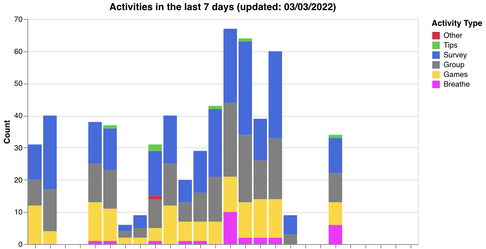

# Data Quality

## Why care about passive data?

- It is collected continuously, in the background.
- It can be used to help understand behaviors.
- Correlations with survey data can provide interesting insights. 

Missing data is problematic because it will affect the validity of passive features. There are multiple reasons you could have low data collection including:
- Permissions not set properly
- Low battery
- App has not been used in a while
- Remote area (for GPS)
- Phone not in use (OS turns off data collection)

As such, it is important to monitor data to ensure that you have enough data to create good quality features. If you have participants with low data, you can follow up and try to resolve the issue. We have created visualizations that can be attached to your Data Portal on the Dashboard to provide a summary of your participant's data. These include:
- Activity counts over the last week
- A measure of screen, GPS, and accelerometer quality over the past week
- Average screen time, steps, and home time over the past week, as a sanity check



Graphs are attached to the Data Portal. To Navigate to the Data Portal, 

To generate these graphs, you can either call a function from Cortex, or download the source code from Github and run a bash script.

To use the Cortex function, make sure that Cortex is installed. Then use the following code (substituting "researcher_id" with your own ID):
```
import cortex
cortex.visualizations.data_quality.data_quality(researcher_id)
```

To run the bash script, first clone the cortex repository from source:
```
git clone https://github.com/BIDMCDigitalPsychiatry/LAMP-cortex.git
```
Then from inside the LAMP-cortex folder run the bash script (substituting "researcher_id" with your own ID):
```
./cortex/visualizations/run_data_quality.sh "researcher_id"
```
