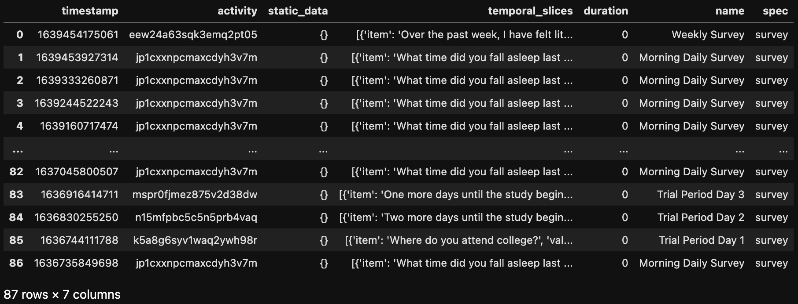

# Activity functions

## `utils.useful_functions.propagate_activity`
Propagate activity takes an activity from a "base user" and copies the information to all other users in the list. New activities will not be created, but the information from the base user's activity will be copied into the activity with the same name in other participants if it exists.

#### Args

- `base_user`: (string) the participant id to copy the activity from.
- `activity_name`: (string) the name of the activity to copy.
- `parts`: (list of strings) the list of participant ids to copy the activity.
- `excluded_tags`: (list of strings, default: []) a list of any tags that should not be copied from the base activity to other participants.

#### Example

```markdown
utils.useful_functions.propagate_activity(base_user="U1234567890", activity_name="Sleep Survey", parts=["U11111111", "U22222222"])
```


## `utils.useful_functions.get_activity_names`
Match the ActivityEvents and names / specs from Activities for a participant.

#### Args

- `part_id`: (string) the participant id.

#### Returns
A dataframe with the ActivityEvent data with additional columns called "name" and "spec".

#### Example

```markdown
utils.useful_functions.get_activity_names("U1234567890")
```
Output:



