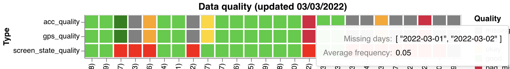
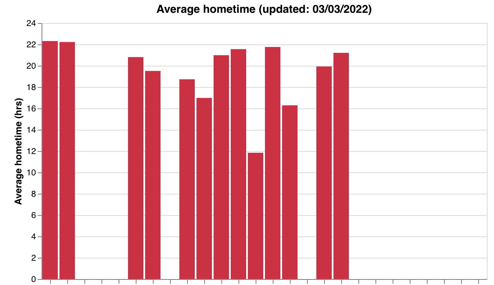
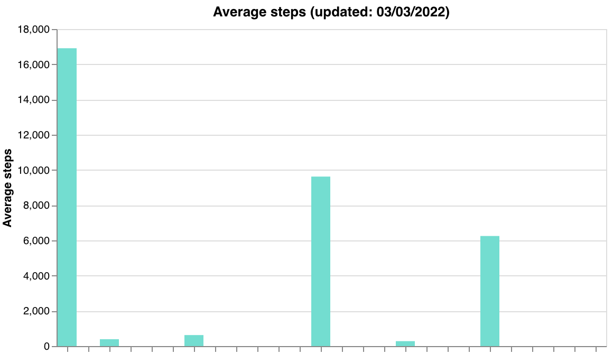
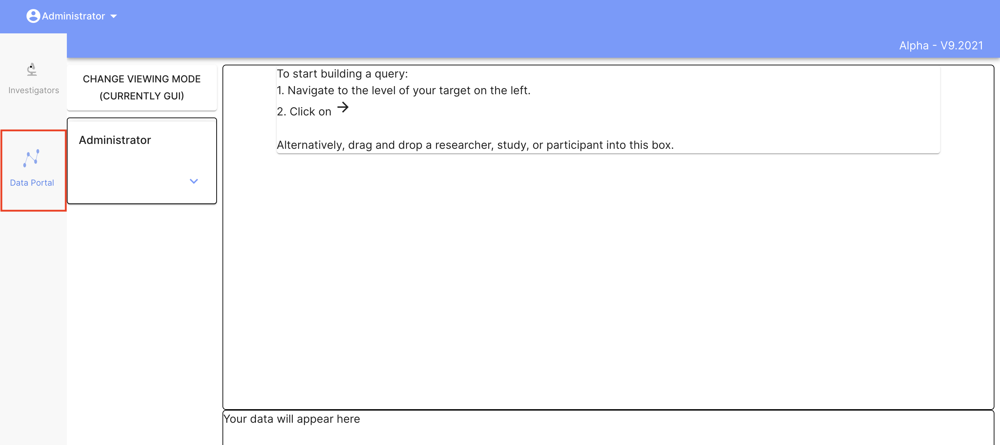

# Data Quality

## Why care about passive data?

- It is collected continuously, in the background.
- It can be used to help understand behaviors.
- Correlations with survey data can provide interesting insights. 

Missing data is problematic because it will affect the validity of passive features. There are multiple reasons you could have low data collection including:
- Permissions not set properly
- Low battery
- App has not been used in a while
- Remote area (for GPS)
- Phone not in use (OS turns off data collection)

As such, it is important to monitor data to ensure that you have enough data to create good quality features. If you have participants with low data, you can follow up and try to resolve the issue. We have created visualizations that can be attached to your Data Portal on the Dashboard to provide a summary of your participant's data. These include:

### 1) Activity counts over the last week:


### 2) A measure of screen, GPS, and accelerometer quality over the past week:
The graph has tool tips. If you hover over a colored block in the graph it will tell you the computed data frequency (percentage of hours with data) as well as any days where the participant had no data.



### 3) Average screen time, steps, and home time over the past week, as a sanity check:





To generate these graphs, you can either call a function from Cortex, or download the source code from Github and run a bash script.

To use the Cortex function, make sure that Cortex is installed. Then use the following code (substituting "researcher_id" with your own ID):
```
import cortex
cortex.visualizations.data_quality.data_quality(researcher_id)
```

To run the bash script, first clone the cortex repository from source:
```
git clone https://github.com/BIDMCDigitalPsychiatry/LAMP-cortex.git
```
Then from inside the LAMP-cortex folder run the bash script (substituting "researcher_id" with your own ID):
```
./cortex/visualizations/run_data_quality.sh "researcher_id"
```

### Where are the graphs I've generated?
Graphs are attached to the Data Portal. To Navigate to the Data Portal, go to the Dashboard and click "Data Portal" on the left hand side:



Search for and select your researcher. Then toggle the button next to "Analyze participant data" to see the researcher graphs.


Here, under graphs.data_quality, you should see the three graphs shown above: activity counts, passive features, and quality tags (along with any others you may have created). You can click on the buttons to view each graph.


For more information, please go to the Data Portal section of the documentation.

## Additional functions
We have added a couple of additional functions that can be used for more specialized situations. They are listed below and can be adapted to fit the needs of your specific study.

### `visualizations.data_quality.make_survey_count_graph_by_name()`
Creates a graph of the counts for a specific survey / activity.

#### Args

- `participants`: (list of strings) the list of participant ids and names. `visualizations.data_quality.get_parts(researcher_id)` can be used to generate a list.
- `researcher_id`: (string) the name of the researcher id to attach the graph to.
- `name`: (list of strings) the exact name of the survey.

#### Example

```markdown
part_list = [{"participant_id": "U11111111", "study_name": "participant1"},
             {"participant_id": "U11111112", "study_name": "participant2"},
             {"participant_id": "U11111113", "study_name": "participant3"},]
visualizations.data_quality.make_survey_count_graph_by_name(participants=part_list, researcher_id="abcdefg1234", name="Morning Daily Survey")
```

### `visualizations.data_quality.make_percent_completion_graph()`
Creates a graph for the percent of required activities completed. Required activities are specified in the spec (see example below).

#### Args
- `spec`: (dict) the specification dict. This includes information about which activities and how many the participant should have completed in the last X days. If a study / researcher id is given, it will be exapanded to the participant level. Please see the example below.
- `researcher_id`: (string) the name of the researcher id to attach the graph to.
- `name`: (list of strings) the name of the graph.

#### Example

```markdown
mod_dict = [
                   {
                       "activity_name": "Mindfulness",
                       "count": 3,
                       "time_interval": MS_IN_DAY * 5
                   },
                   {
                       "activity_name": "Morning Daily Survey",
                       "count": 7,
                       "time_interval": MS_IN_DAY * 7
                   }
            ]
mod_dict_2 = [
                   {
                       "activity_name": "Weekly Survey",
                       "count": 1,
                       "time_interval": MS_IN_DAY * 7
                   },
                   {
                       "activity_name": "Morning Daily Survey",
                       "count": 7,
                       "time_interval": MS_IN_DAY * 7
                   }
            ]
spec = {"U2134213402": mod_dict,
        "U3372337202": mod_dict,
        "qwifh12839": mod_dict_2,
       }
visualizations.data_quality.make_percent_completion_graph(spec=spec, researcher_id="abcdefg1234", name="activity_completion")
```
In this example, participants "U2134213402" and "U3372337202" were required to complete 3 "Mindfulness" activites in the past 5 days. All participants under the "qwifh12839" study were required to complete 1 "Weekly Survey" and 7 "Morning Daily Survey" activities in the past week. 

### `visualizations.data_quality.clear_chart()`
Removes a chart from a researcher's Data Portal page.

#### Args

- `researcher_id`: (string) the name of the researcher id where the graph is attached.
- `name`: (list of strings) the name of the graph.

#### Example

```markdown
visualizations.data_quality.clear_chart(researcher_id="abcdefg1234", name="data_quality_graph")
```


