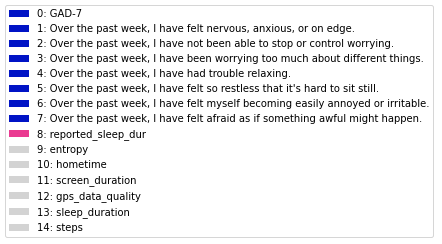
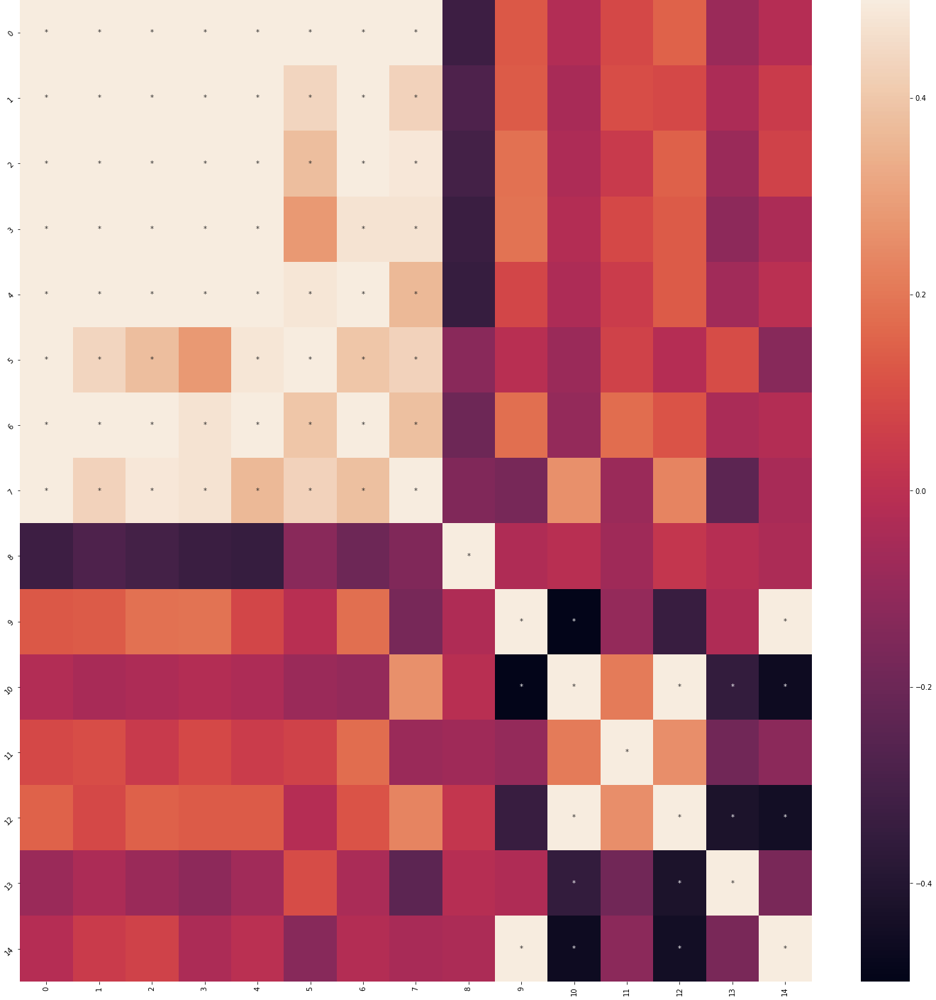
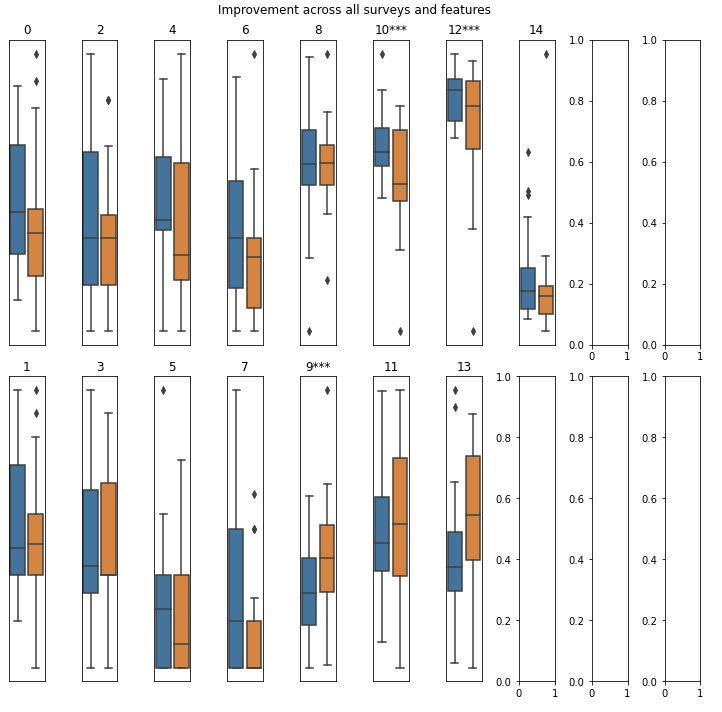

# Basic Analysis

There are some basic analyses that are useful for exploring study data. The Jupyter Notebook cortex/visualizations/correlation_plots.ipynb has code to:
1. Score survey data and save it into a user specified directory.
2. Load survey data, passive data features, and any other researcher-generated features to generate correlation plots.
3. Compare features across groups of interest.
4. Fit a basic logistic regression model to predict the participants group based on the features.

While these functionalities are by no means comprehensive, they can provide a starting place for further exploration.

### Data

#### Survey data

Surveys are scored using Cortex's score_surveys() function. Results are saved by survey category by participant in individual csv files. Each csv file will have a column for the timestamp as well as columns for each question in the survey and a total score.

#### Passive data

Passive data should be processed prior to analysis. cortex.run() can be used to generate the file format required. In particular, secondary features should be in pickle files with a column for timestamp and a column for the value of the secondary feature.

#### Other features

Additional data can come in the form of "global" data or data that holds true across the entirety of the study (ex: number of activities, age). These features should be stored in a csv file called participantId_other_global_features.csv where each column of the dataframe is a differnet global feature. Each column that you would like to be used in analysis should be listed in the list OTHER_GLOBAL_FEATS. 

Other local features are "local" in time. These features look just like survey or passive data in that they will have a timestamp column (in ms) as well as columns for each feature. The file can be named anything, and the name of the file may or may not be in the columns. Using this filename, files will be saved in SURVEY_DIR as participantID_filename.csv. OTHER_LOCAL_FEATS should be a list of all of these file names. Then you must specify which columns in each file that should be usef in analysis. An example of how to do this in OTHER_LOCAL_SUBFEATS is shown below.

### Analysis
For example, we could look at GAD-7 questions, sleep duration, and some passive data features from one of our studies. These example features are listed below.

#### Correlations
Using these features, we could then produce a correlation map. The * indicate signficant correlations (p < 0.05, corrected for multiple comparisons).

#### Comparison across groups
We could then look at whether these features differed among participants that improved over the course of the study. Significantly different groups based on a t-test (p < 0.05, corrected for multiple comparisons) are marked with *. Entropy, home time, and GPS data quality differ between the group that did and did not improve. 

#### Logistic regression model
Finally, we fit a logistic regression model to predict which participants improved. The model achieved an AUC of 0.862 and had three non-zero coefficients:

 Feature | Coefficient
---------|------------
 entropy | 0.468
 screen_duration | 0.212
sleep_duration | 0.223

From here, we can take a deeper look at why some features may be different across groups or investigate the relationships between correlated variables. The goal of these visualizations is to provide a starting point for further analysis.

