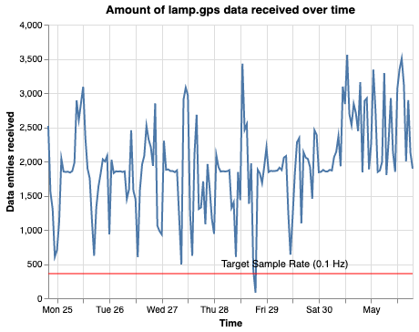
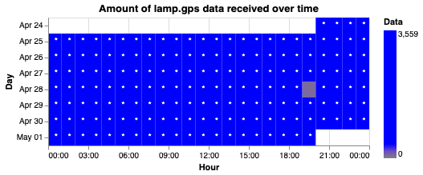
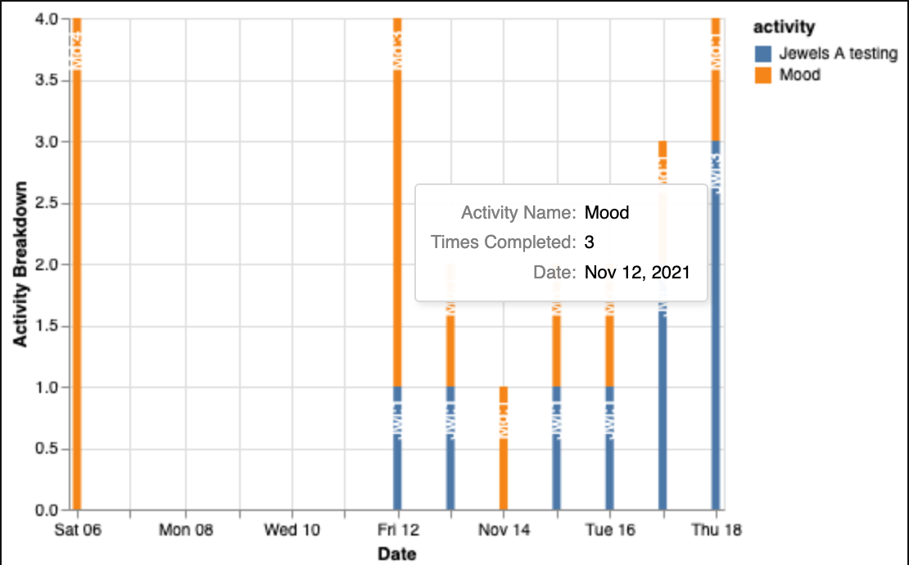
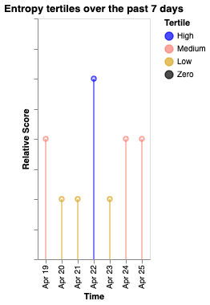
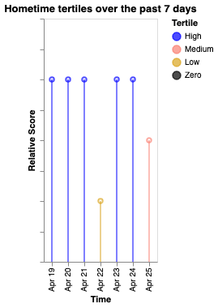
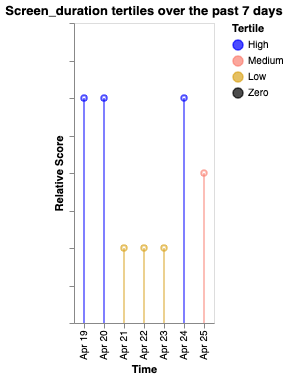

# Participant-Level Visualizations

At times, it may be necessary to run specific analyses on one participant - for example, to ensure continuous data quality monitoring or check the level of interaction with LAMP. The following functions are designed to run on a specific participant and return information that may be helpful either with monitoring LAMP data collection or examining cortex scores

## Passive Data Quality

### Function
```
    cortex.visualizations.participant.passive(id)
```
This function produces two graphs intended to help assess data quality - a scatterplot and a heatmap, which both show on an hourly level the amount of data collected over the previous week. Data is stored in attachments to prevent unnecessary server load on subsequent runs - as such, this can be run repeatedly throughout the week to speed up individual runs.

### Parameters

- `id_list`: A string or array of strings of LAMP ids (participant, study, researcher)
- `show_graphs`: If True, graphs are displayed in the output
- `attach_graphs`: If True, graphs are attached to the participant
- `display_graphs`: If True, graphs are attached to the study and researcher for display
- `days_ago`: The number of days ago the analysis should end. If 0, analysis ends on the current timestamp
- `sample_length`: The number of days to query data for
- `set_to_utc_midnight`: If True, timestamps are adjusted to UTC midnight
- `reporter_func`: The function that should output important logging info. Use with a webhook, for example logging to slack
- `return_dict`: If true, returns a dictionary containing data output. Else returns None.
- `reset`: If true, data from previous runs will be deleted.

### Code Example

```
researcher_id='ffmz65mn1gtav5fq3bhq'
cortex.visualizations.participant.passive(researcher_id,attach_graphs=False)
```

First Time:
```
Found no U5946075691 data under lamp.analysis.Accel_Quality_stored
Querying for U5946075691 - Accel_Quality
```
Repeat Time:
```
Querying for U5946075691 - GPS_Quality
Previous data was found. 168 chunks were excluded.
```

Scatterplot:

Heatmap:


## Active Data Quality

### Function
```
    cortex.visualizations.participant.active(id)
```
This function produces a graph intended to help assess participant interaction with lamp - a stacked bar chart, which shows on an daily level the number of LAMP activities collected each day. 

### Parameters

- `id_list`: a string or array of strings of LAMP ids(participant, study, researcher)
- `target_array`: a list of specs, names, or ids to display. Default is all. Include '' to show all activities.
- `exclude_array`: a list of names to exclude. Default is None.
- `exclude_groups`: attempt to exclude group completions
- `show_graphs`: if True, graphs are displayed in the output
- `attach_graphs`: if True, graphs are attached to the participant
- `display_graphs`: if True, graphs are attached to the study and researcher for display
- `graph_name`: set to another string to override the default name
- `days_ago`: the number of days ago the analysis should end.If 0, analysis ends on the current timestamp
- `sample_length`: The number of days to query data for
- `reporter_func`: The function that should output important logging info.Use with a webhook, for example logging to slack
- `return_dict`: If true, returns a dictionary containing data output. Else returns None.

### Code Example

```
cortex.visualizations.participant.active('U1978824471',attach_graphs=True,days_ago=160,sample_length=30)
```



## Cortex Tertiles

### Function
```
    cortex.visualizations.participant.cortex_tertiles(id)
```
This function produces a graph intended to help assess how participant's cortex measures change day by day. Using a 'lollipop' chart, researcher can visualize whether a particpant's scores on different cortex measures are high, medium, or low, relative to a week's worth of measurements.

### Parameters

- `target_id`: Required. a string or array of LAMP user, study, or researcher ids.All user ids below one or more ids in the list (if applicable) will be run
- `cortex_measures`: Default:['acc_energy','entropy','hometime','screen_duration']. a string, list, or dict of cortex measures. If a dict, keys will be used for the array fed into run and the values will be used as labels. E.g. `{'sleep_periods':'Sleep'}`
- `measure_params`: Measure params to pass into cortex
- `use_cache`: If true, attempt to use cached data
- `show_graphs`:Default True. a boolean - whether to show graphs generated to the user running the function call
- `attach_graphs`:Default True. a boolean - whether to attach graphs to the participant as a tag
- `display_graphs`:Default True. a boolean - whether to display graphs tothe participant on their prevent page
- `days_ago`: Default 0. Number of days ago to end analysis. Set to 0 to end analysis today
- `sample_length`: Default 7. Timespan for analysis, in days.
- `reporter_func`: Default 'print'. A function which should take one variable,which are outputs from this function, and displays them to a user
- `set_to_utc_midnight`: Default True. Whether or not to set the utc time to true
- `return_dict`: Default False. Whether or not to return a dictionary of all cortex outputs at the end.

### Code Example

```
cortex.visualizations.participant.cortex_tertiles(['U1978824471'],attach_graphs=True,use_cache)
```



