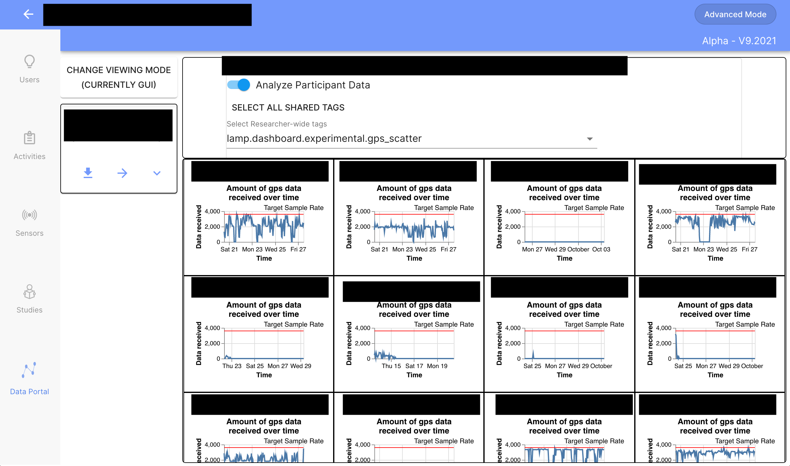
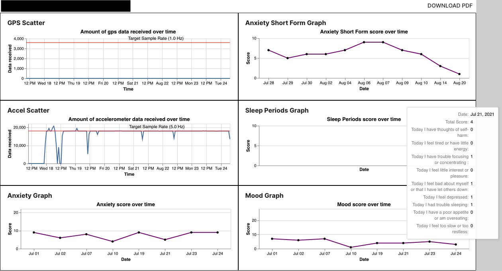
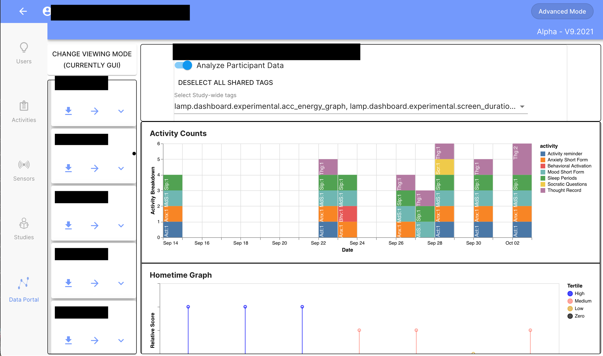
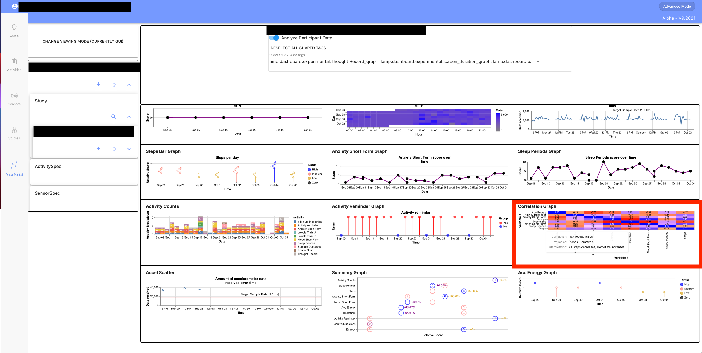

# Using the LAMP Data Portal

# Overview

As of late September 2021, the latest versions of the LAMP platform includes a data analysis platform that allows a researcher to do some basic analyses, download data, or view pre-made graphs.

The data portal is accessible in three ways:
1. After logging in as an administrator, click the 'Data Portal' tab on the left or bottom of your screen.
2. After logging in as a researcher, click the 'Data Portal' tab on the left or bottom of your screen.
3. Direct navigation to [dashboard.lamp.digital/#/data_portal](dashboard.lamp.digital/#/data_portal)

At this time, the data portal is not accessible using participant credentials.


## Data Portal Options

There are two main ways to use the data portal - Terminal Mode and GUI Mode. To switch between these modes, click on the button marked 'Change Viewing Mode' in the upper right corner of the data portal. Choose your desired viewing mode with the toggle, then press the button marked "Set Viewing Mode" to set the current mode.

- Terminal Mode allows a user to write custom queries using the JSONata query language and directly query a LAMP database. For more information about valid JSONata queries, please see [this section of the LAMP docs](https://docs.lamp.digital/data_science/jsonata)
- GUI Mode allows a user to see pre-rendered graphs or other data that have been attached to user, study or researcher as a LAMP Tag. LAMP Tags are special pieces of information attached to a user, study, or researcher. Please see the GUI Mode section below for how the LAMP Data Portal uses tags, or [the LAMP API docs](https://docs.lamp.digital/api/list-all-tags-set-for-or-by-a-researcher-study-participant-activity-or-sensor) for information on tags and how to set and retrieve them.

Both modes allow a user to download activity data (surveys, cognitive games, etc.) in the form of a csv.

## Downloading your data

To download activity event data for a researcher, study, or specific participant, follow these instructions, which can be done in either viewing mode.

1. Using the Collapse/Expand arrow buttons in the listings on the left side of the portal, navigate through your researchers (if applicable), studies, and/or users until you can see the target you want to download. If you have many users, you may find it helpful to use the search functionality by clicking the magnifying glass icon.
2. Press the Download button to the left of the Collapse/Expand button to bring up the selection window.
3. Change the auto-generated file name if necessary, then click the download button.

At this time, it is not possible to download sensor data through the data portal due to the high volume of data required. To download sensor data for analysis, please see the appropriate section in the `Cortex and API` section of the LAMP docs based on your chosen programming language.


# Mode Specific Information

## Terminal Mode


As described above, terminal mode allows you to write and execute valid JSONata queries to directly query the database, either to read data or set new parameters such as tags, which can be used by LAMP in a variety of ways. The process of using the terminal is very simple:

1. Click in the terminal on the right side of the page and type a valid JSONata query, such as $LAMP.Study.list('RESEARCHER_ID_HERE'), which will list all studies under a specific researcher.
2. Press the 'Run Query' button in the bottom right of the page. The result of your query will appear in the box below the terminal, which should also expand to give you a better look at the result.
3. To write another query, simply return to step 1.


## GUI Mode

GUI Mode allows you to easily see pre-existing data stored in LAMP - and is particularly useful for looking at pre-made graphs.

The LAMP data portal uses the Vega visualization grammar library to generate graphs. For more info on generating graphs with Vega, please visit [their docs](https://vega.github.io/vega/docs/).

To analyze data for a researcher, study, or participant, navigate to the target you want to see using the Collapse/Expand arrows in the listings on the left of the data portal, then either click the right-facing arrow or, on a desktop computer, drag and drop your target into the top box on the left side of the page.

If you are analyzing a researcher or study, you can choose between 'Analyze Participant Data,' which shows you data on a researcher or study-wide level across all or multiple participants, or switch the toggle off to analyze specific tag info about the researcher or study. This second option is the only one available if you are analyzing a participant.


### Researcher/Study-wide analysis
To analyze shared tags, use the dropdown menu to check boxes corresponding to the tags/data you would like to see. This list is sourced from either the `lamp.dashboard.researcher_tags` or the `lamp.dashboard.study_tags` tag - if you do not see info that you expect to in this dropdown, or you see a message that there are no shared tags, try editing either `lamp.dashboard.researcher_tags` or `lamp.dashboard.study_tags`, making sure it is an array of tags you want made available. A valid example would be:
```["lamp.dashboard.experimental.gps","lamp.dashboard.experimental.Exercise Habits","lamp.dashboard.experimental.Self Esteem"]```

You can also simply click 'Select All Shared Tags' to load all selected data.

Once you have loaded your data, you can click the "Adjust Graph Display" button to change the size of your graphs, filter by a *participant* ID (or name, if they have one assigned), or change how graphs are grouped (by participant or by graph name). You can also download a PDF with the displayed graphs by clicking the 

### Specific data analysis
To analyze specific data, use the 'Select tag categories' dropdown menu to select a category of tag you would like to see more details about, then select a specific tag name that is listed. If you are using publicly available LAMP analysis code - e.g. from a GitHub repository or other publicly available site, graphs are likely under the 'experimental' category.


# Data Portal Usage Examples

Below are some examples and ideas to get you started using the LAMP Data Portal.


**Example 1**: By plotting number of gps(or other passive measure) data points received by hour, you quickly identify which (if any) of your participants may be having data collection issues. Prevent unpleasant end-of-study realizations by ensuring that all your participants are collecting the highest quality data possible.  


**Example 2**: Use Vega's easy to create and manage tooltips to fit far more data into a single graph than would be possible in a traditional paper graph - here, for example, you can both see how survey responses trend and examine specific surveys in detail.  


**Example 3**: Keep track of which activities (and how many) your participants are doing with Vega's stacked bar plots.  



**Example 4**: Use an array of charts to examine a participant's data in great detail. Here, find examples of summary graphs which show changes over time, correlation heatmaps which highlight connections between different LAMP measures (outlined in red), and the activity tracking functionality seen in example 3.  

### Help & Updates
The LAMP data portal is currently in alpha, as is this documentation. We are actively seeking both feedback and requests about the usability and usefulness of the data portal and this documentation. Please give us any questions, comments, or feature requests either through our [community page](community.lamp.digital) or our public [GitHub repository](https://github.com/BIDMCDigitalPsychiatry/LAMP-platform/issues)
