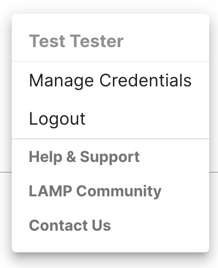
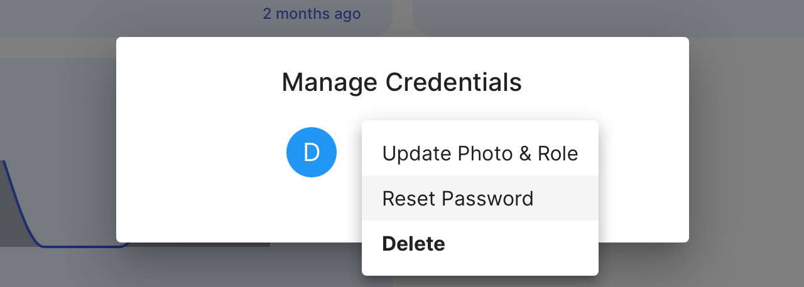
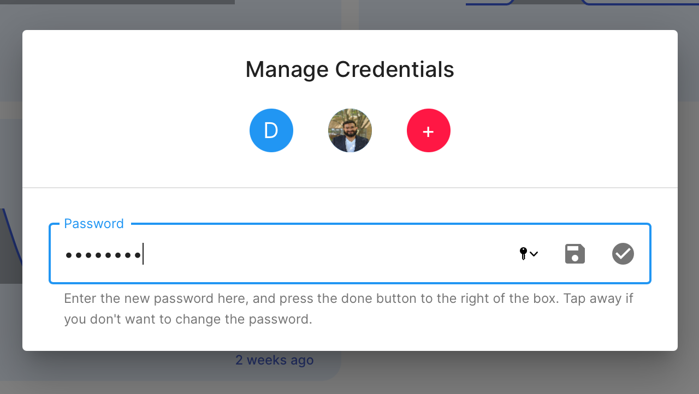
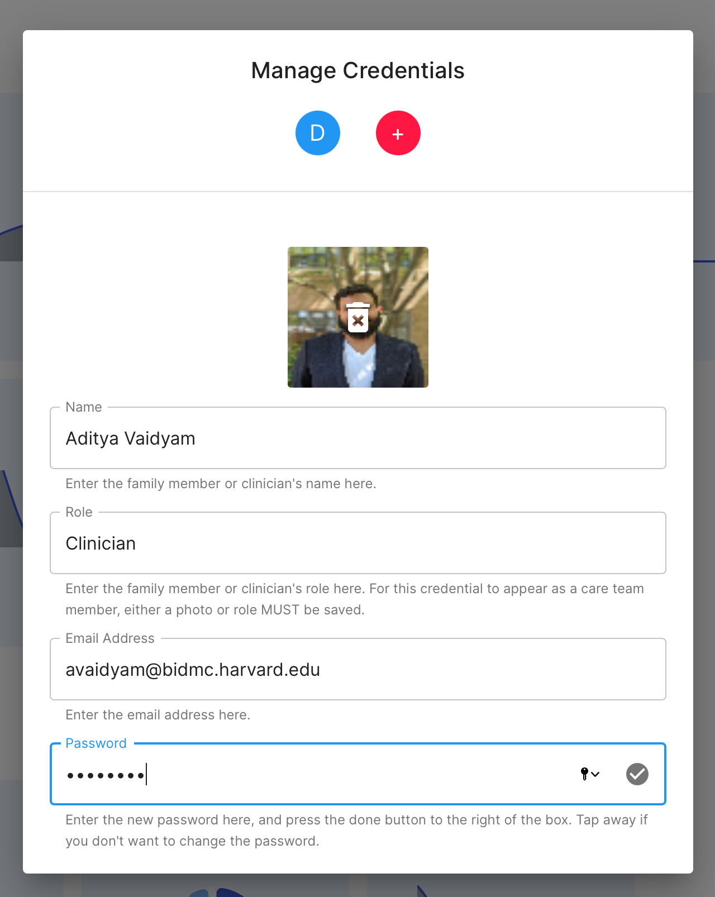
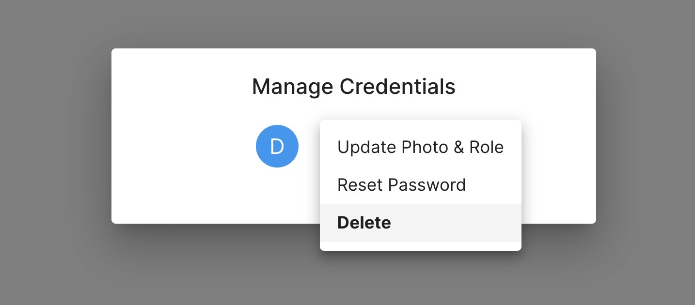

## Reset a Clinican's or Researcher's Password (Admins Only)

1. Log into the app and click on the "Users" tab.
2. Tap the profile icon at top left and select the Manage Credentials option from the drop-down list. 
3. Tap the credential whose password you wish to change
4. Enter the password and tap the check mark icon at the right side of the text box to save your new password.

**DO NOT** attempt to reset the password of the credential you are currently using to log into and access mindLAMP. This may prevent you from using the app and lock you out.

# Change a Clinician or Researcher Log In Email (Admins Only)

To change a log in email for a clinician, you must create a new credential and delete the old one.

1. Log into the app and click on the "Users" tab.
2. Tap the profile icon at top left and select the Manage Credentials option from the drop-down list. 
3. Tap the `[+]` icon and enter only: **Name, Email Address, and Password.** You can ignore the **Image** and **Role** field.
4. Click the check mark to save your credential.
5. Again, tap the profile icon at top left and select the Manage Credentials option from the drop-down list. 
6. To delete the old credential, tap its icon and select the `Delete` option from the drop-down list.

**If you are locked out of your account, please consult your clinician or system administrator/your organization's IT department for assistance.**

