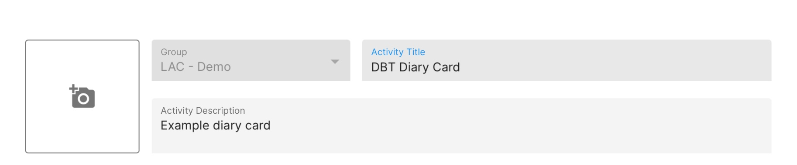
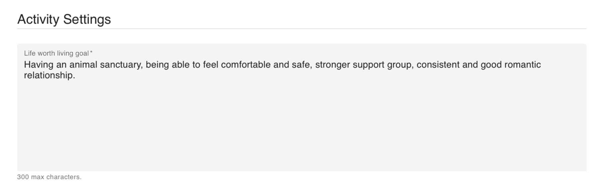

# Customize a DBT Diary Card
1. Log in to the dashboard and navigate to the Activities tab.
2. Click the `[+ Add]` button at the top right of the list.
3. Select DBT Diary Card.

4. Create a title for the client's DBT Diary Card.

5. Add the life worth living goal in the text box directly under "Activity Settings".

