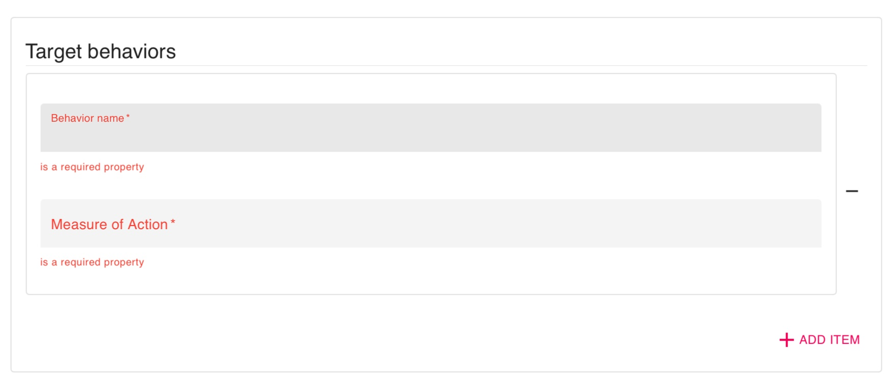
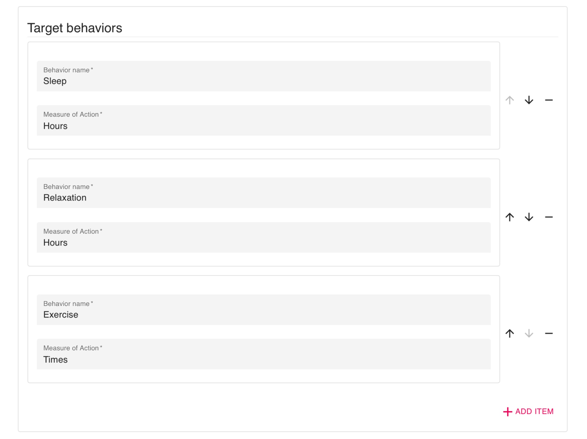
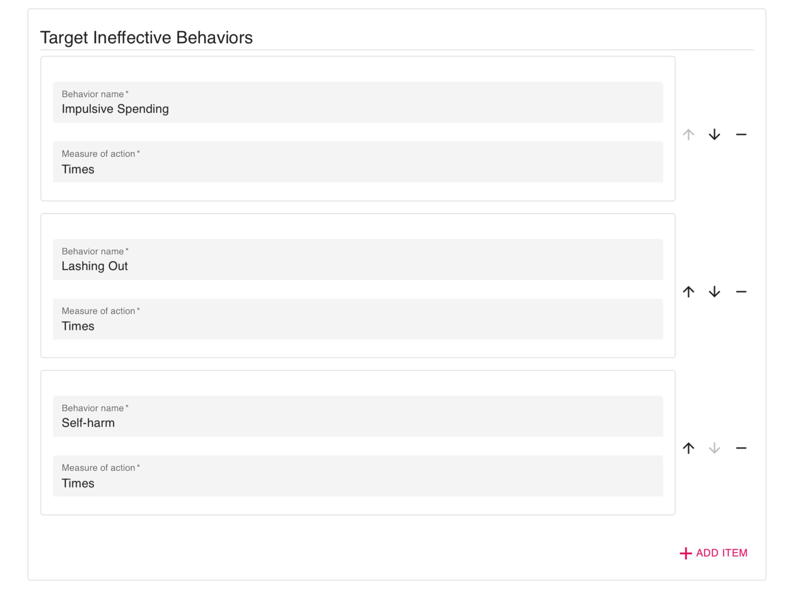

# Customize Target Behaviors on a DBT Diary Card

<iframe width="560" height="315" src="https://www.youtube.com/embed/XoHRfndEPz4" title="YouTube video player" frameborder="0" allow="accelerometer; autoplay; clipboard-write; encrypted-media; gyroscope; picture-in-picture" allowfullscreen></iframe>

1. Log in to the dashboard and navigate to the Activities tab.
2. Click the `[+ Add]` button at the top right of the list and select DBT Diary Card.
3. Create a title for the client's DBT Diary Card.
5. Add the life worth living goal.
6. To add target behaviors, select the red `[+ ADD ITEM]` text.

7. Type in a behavior name and select either Times, Hours, or Minutes.
8. Once you have finished, you will have a list of target behaviors.

9. Repeat the same process for target ineffective behaviors.

