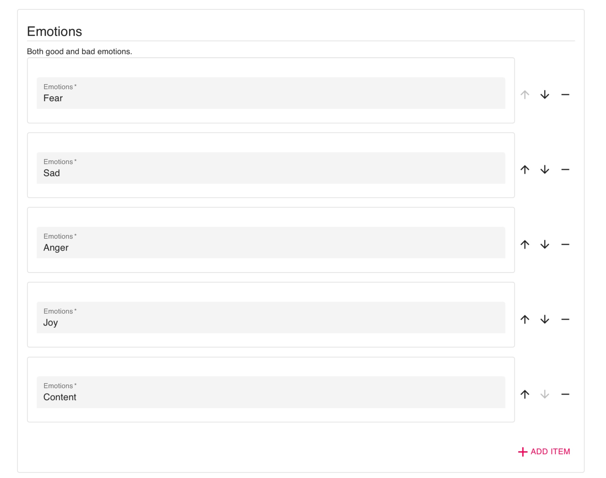

# Customize Emotions on a DBT Diary Card
1. Log in to the dashboard and navigate to the Activities tab.
2. Click the `[+ Add]` button at the top right of the list and select DBT Diary Card.
3. Create a title for the client's DBT Diary Card.
5. Add the life worth living goal.
6. Add target behaviors and target ineffective behavoirs.
7. Add an emotion by selecting the red `[+ ADD ITEM]` text.
8. Type the emotion in the text box.

9. Save the customized diary card.

