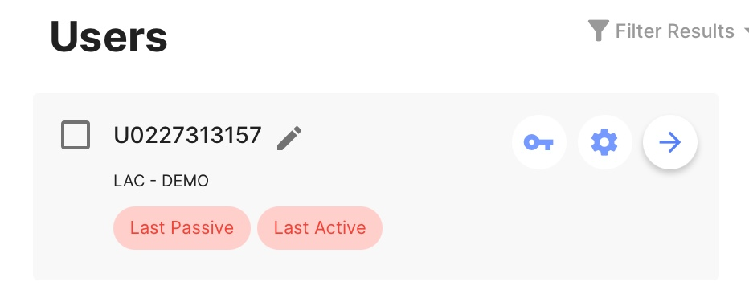

# Complete a DBT Diary Card for a Client

1. Open your phone or desktop browser and navigate to the mindLAMP app.
2. Log in with your credentials.
3. Navigate to the "Users" tab.
4. Select the arrow next to the client's U-id to impersonate their account.

5. You will see a blue bar at the top of the screen that shows you are impersonating the client.

6. Navigate to the Assess tab.

7. Select "DBT Diary Card" and click "Start Survey."

