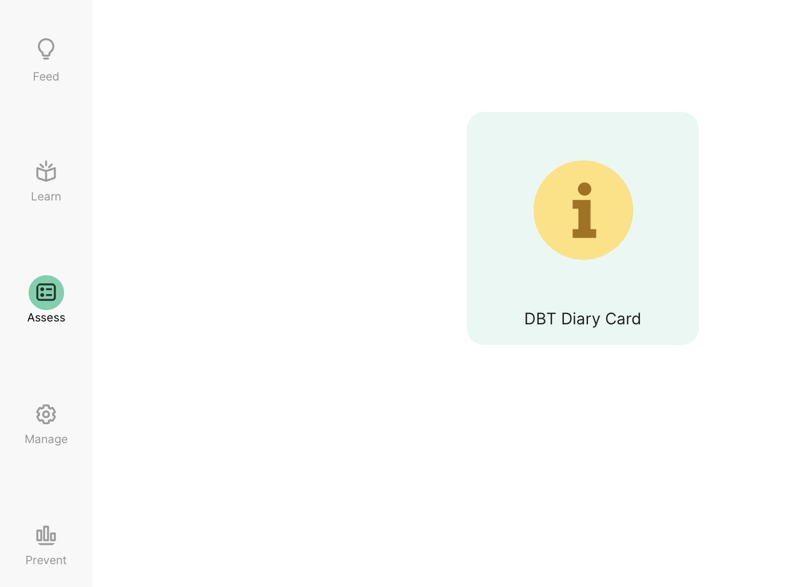
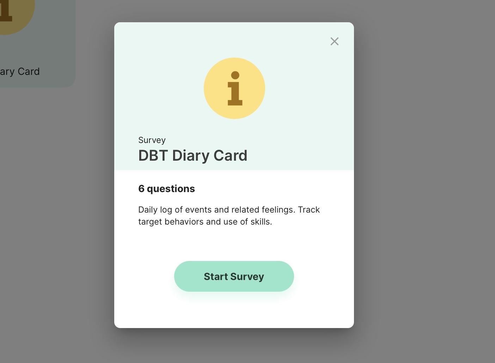
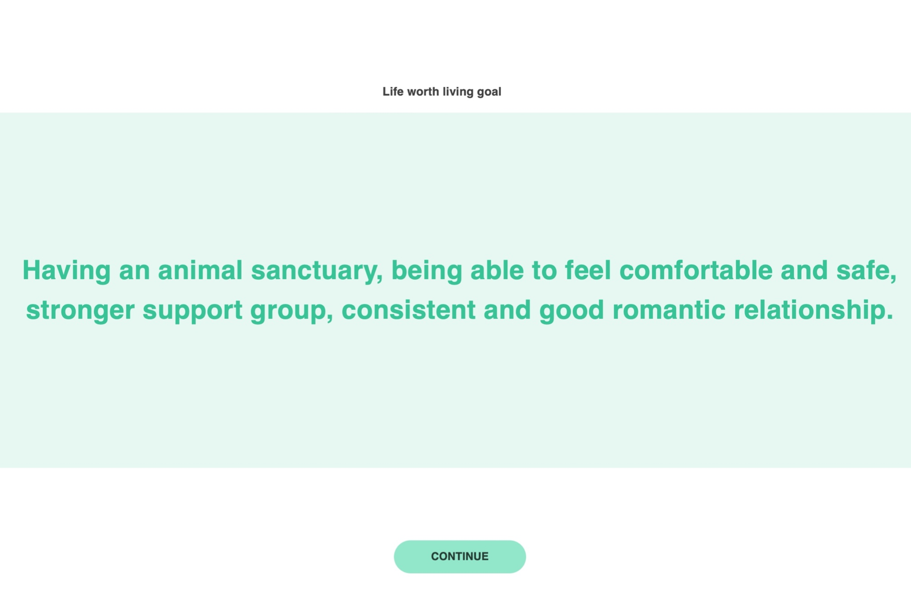
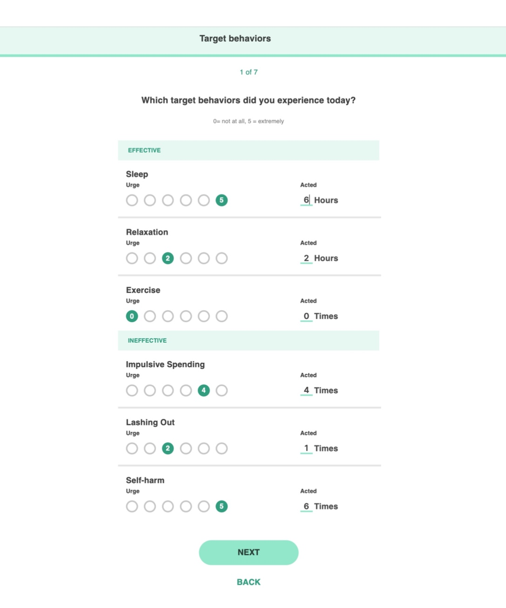
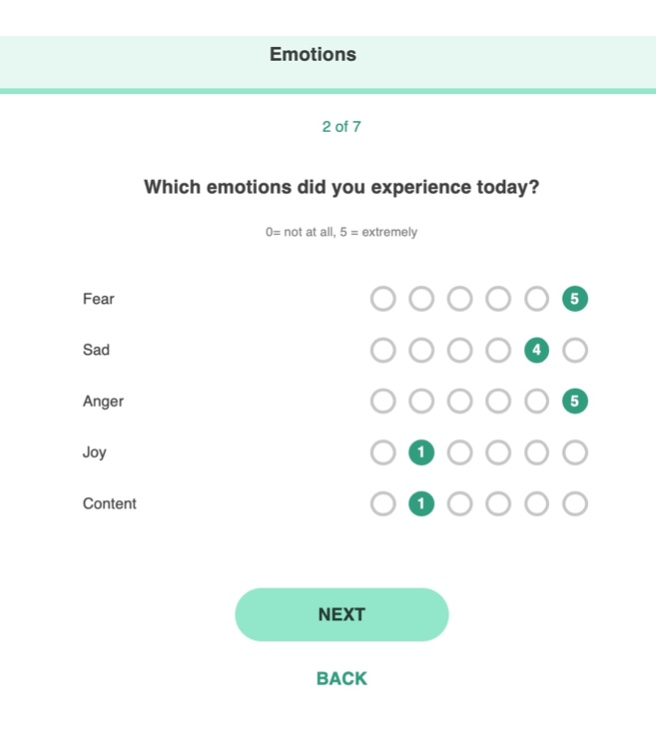
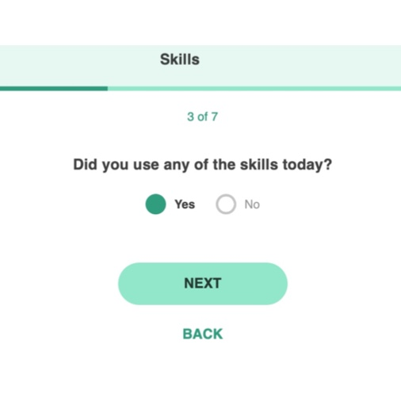
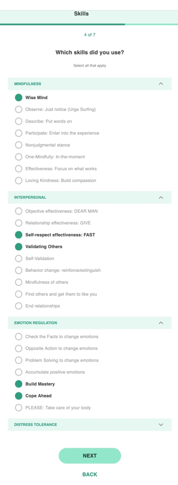
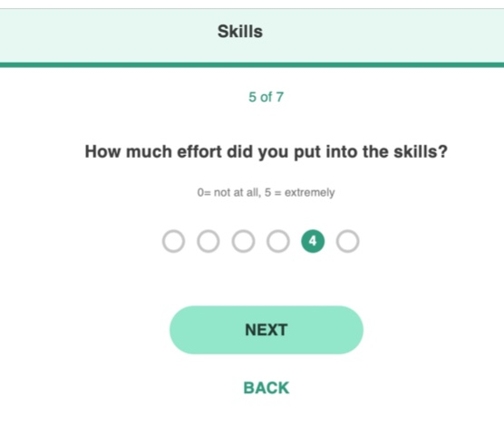
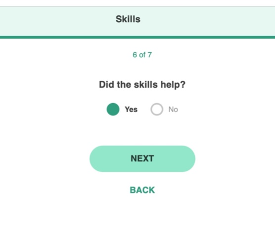

# Add Emotions to Your DBT Card
1. Log into the mindLAMP app or dashboard.
2. Navigate to the Assess tab.
3. Click on DBT Diary Card.
4. Select "Start Survey."
5. Click "Continue" after seeing your life worth living goal.
6. Complete your target behaviors and select "Next." 
7. Complete the emotion page and select "Next."
8. Next, you will be prompted to answer if you have used any skills. Select Yes or No. 
9. If you select yes, you will be taken to a list of all skills. Click on each section to expand the options, and select any skills you used. 
10. Select "Next" to rank from 0-5 how much effort you put into the skills you used. 
11. Select "Next" to specify if the skills helped. 
12. 
