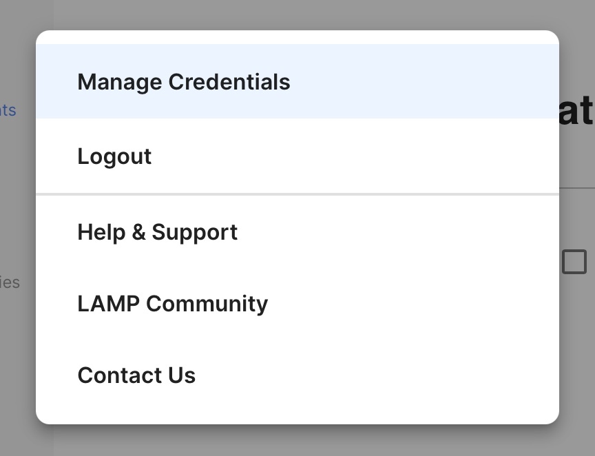

# Create a New Researcher or Clinician Credential

1. Log into the app and click on the "Users" tab.
2. Tap the profile icon at top left in the blue bar and select the Manage Credentials option from the drop-down list. 
3. Tap the `[+]` icon and enter only: **Name, Email Address, and Password.** You can ignore the **Image** and **Role** field.
4. Click the check mark to save your credential.

Note that the email address you provide **MUST NOT** already be used across any credentials in your instance of the LAMP Platform. If the email address specified is already taken, your credential will fail to be created.

The **Name** field of your very first credential will always be reset to `Default Credential`. 

# Video Tutorial

<iframe width="560" height="315" src="https://www.youtube.com/embed/mp9HrcIt4B0" title="YouTube video player" frameborder="0" allow="accelerometer; autoplay; clipboard-write; encrypted-media; gyroscope; picture-in-picture" allowfullscreen></iframe>
