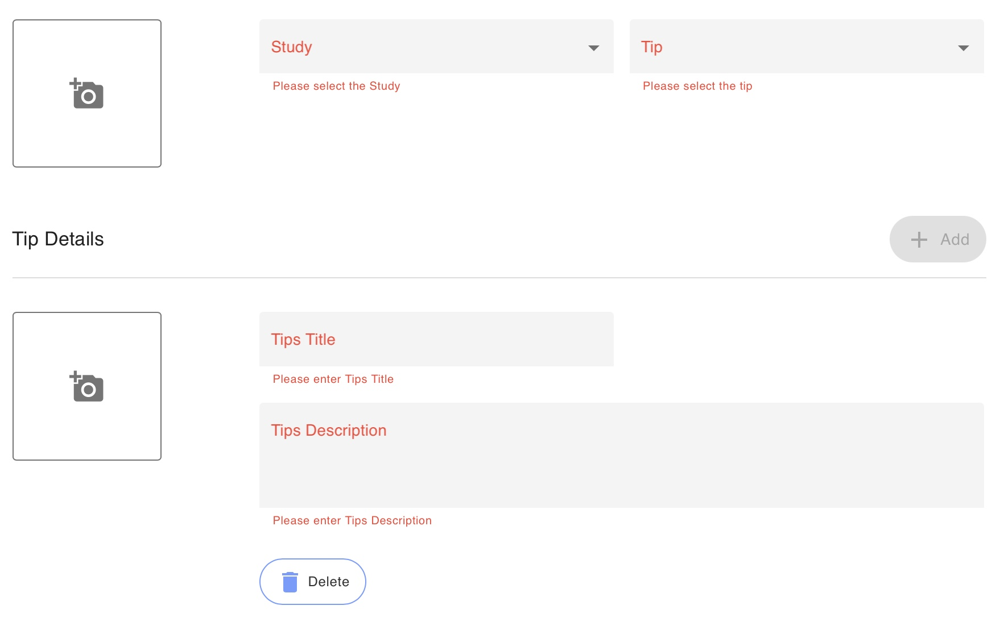

# Create a Tip in Learn

<iframe width="560" height="315" src="https://www.youtube.com/embed/5Hf3CPCgC50" title="YouTube video player" frameborder="0" allow="accelerometer; autoplay; clipboard-write; encrypted-media; gyroscope; picture-in-picture" allowfullscreen></iframe>

*How to Create a Tip from the Patient Profile*

Navigate to the activities page click the “+ Add” button, and then scroll to the bottom and click “tips”.

1. Log in to the dashboard and navigate to the Activities tab.
2. Click the `[+ Add]` button at the top right of the list to begin.
3. Select the study you wish to add the tip to.
4. Title your tip.
5. Copy and paste the link to the tip you want to add. If there is no link this will be left blank.
6. Add the tip author. If there is no author, this will be left blank.
7. Press the `(+)` icon to add an image.

