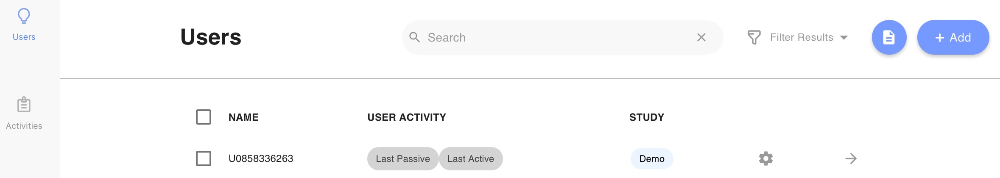
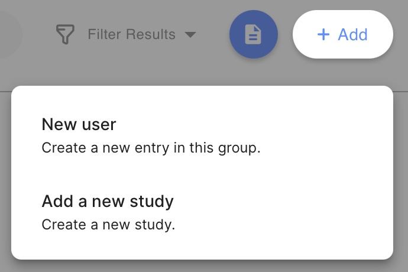
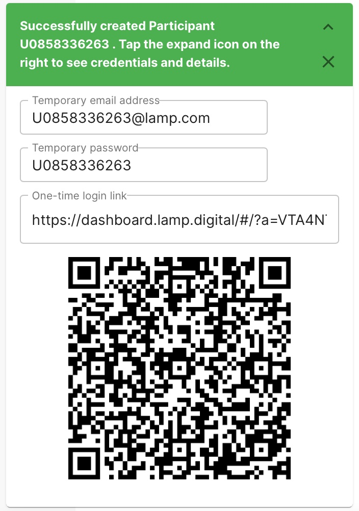
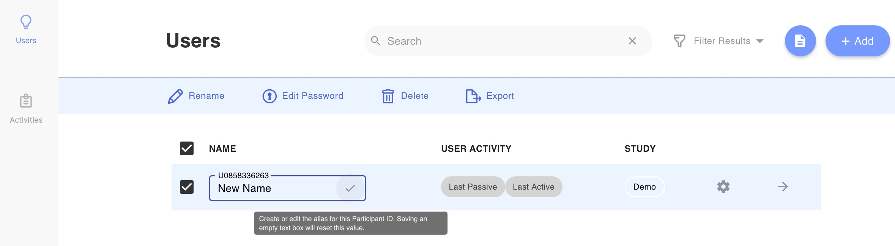

# Create and Rename User

You can add a user to an existing group. See instructions below:

<iframe width="560" height="315" src="https://www.youtube.com/embed/aYqDNHMp9Gg" title="YouTube video player" frameborder="0" allow="accelerometer; autoplay; clipboard-write; encrypted-media; gyroscope; picture-in-picture" allowfullscreen></iframe>

1. Log into the app and click on the "Users" tab.
2. Tap the profile icon at top right and select the Manage Credentials option from the drop-down list. 
3. Tap the `[+]` button at the top right of the list; you will be prompted with a counter for the number of patients/participants to add, as you may want to create more than one at a time.
4. Once you create a patient, you will have the opportunity to input an email address and password. This does **not** need to be a real email. You can make the email anything you'd like (e.g. patient@xyz.com).

# Rename a User

For each patient/participant in the list on this screen, you’ll see an outlined text box containing their de-identified patient identifier, typically beginning with a `U`, followed by a random number of random digits. 

It is not recommended to use full names or other identifying text when referring to patients instead of their patient identifier as this increases your liability and and risk when **complying with HIPAA, COPPA, GDPR, or other federal regulations.**

1. Log into the app and click on the "Users" tab.
2. Check the box next to the patient's name.
3. Tap **Rename** to add, edit, or remove the de-identification alias. 
4. Tap outside of the text box or press the check mark icon at the right side of the text box. You will now see the patient/participant’s identifier as mini hovering text above the text box.

Though it appears that the patient has been “renamed,” this new alias is only visible to you, as a clinician or researcher, and not to the user, or anywhere in the data when saved or exported. 
