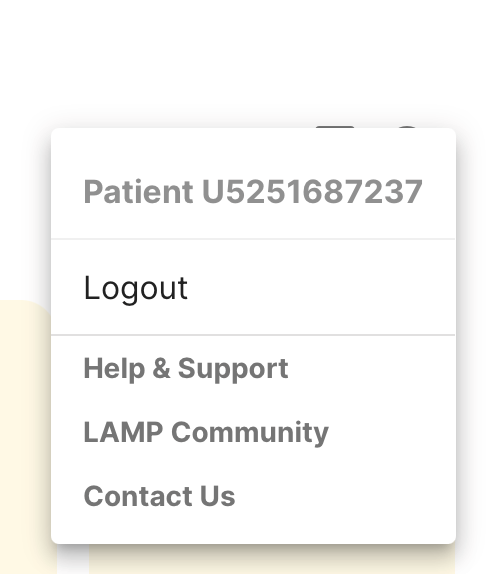

# Troubleshooting

In case your app is running into issues or you have questions regarding setting up, see this section to see if the solutions listed help! If you are a collaborator or a researcher using mindLAMP, please post on our community forums [here](https://mindlamp.discourse.group/). If you are still in need of further assistance, please file a report through our bug reporting form [here](https://docs.google.com/forms/d/e/1FAIpQLSdy354xNzQVekizuSMePWk_F7YGl9ENencXKJ-T0oo4ZTNkaA/viewform).

You can also access these links from within the app after logging in and clicking the person icon in the top right corner. Clicking on 'Help and Support' will take you to this documentation page and clicking 'LAMP Community' will take you to the community forums if you are a collaborator and having problems with the app. The 'Contact Us' button will allow you to email us in case you are encountering a unique issue that was unable to be solved after viewing the documentation and posting on the community forums. See the image of where to click to access these links below.

## For Users

## Redownloading

Many issues occur that might be difficult to reproduce on our end or with other users. A common solution is to attempt uninstalling and the redownloading the app.

## Logging out and logging back in

If you go to the top right corner, click on the person icon, which will allow you to access helpful links to contact us as well as logout. Attempt logging out and logging in to see if an issue you are encountering is resolved.

## Clear data (Android)

For Android users, please go to settings, then apps & notifications. Proceed to click on mindLAMP, then storage & cache, and clear cache to clean data. Sometimes this can help and it will clear stored data on your phone, allowing LAMP to run better. This does not affect data that has already been collected and uploaded, so there is no worry of losing past data.

<head>
  <meta name="google-site-verification" content="MDFm8izKofwRdAnUbqg2muDPnSlHISr1EVApzHUI-Z4" />
</head>
