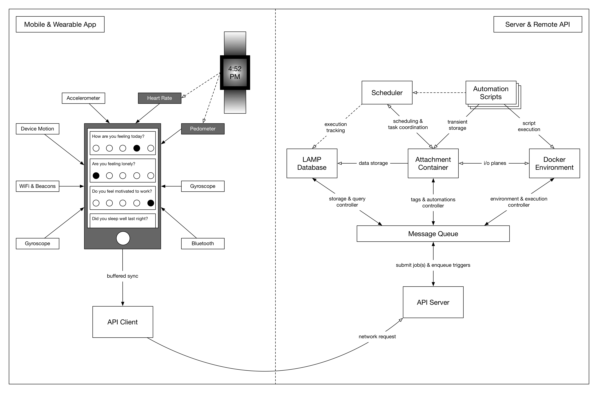

The LAMP Platform API Server manages all internal components and inter-component message-passing. Its components are embedded within Docker containers and use Docker Swarm for orchestration. Docker Compose and Kubernetes may also be used to deploy the components. Please see Deployment Recommendations if you do not plan on using Docker.

### **API Server**

The gatekeeper between the internal and external domains.

- This component is implemented in **Node.js**.
- ****All API requests are stateless (i.e. there is no session management) and map to a single response.
- All requests irrespective of authentication requirement must be accompanied by a client API key. This pre-registered API key is recorded in the audit log with each request and serves as origination reference for resources and events.
- Using the Credential API, requests that require authentication and authorization are validated.
- Data transport must be encrypted and decrypted as per security & privacy policy.

### **Database**

The persistent data storage device supporting transient caching and complex querying.

- This component is implemented by **CouchDB**, with an alternate implementation for low-power usage in **Node.js** using the **PouchDB** framework.
    1. This component can instead by substituted using custom adapter code by **Redis**, **Amazon S3**, or for low-power usage, a naïve **Dictionary/Map** object in **js**.
- A key-value or document database (noSQL) is most ideal for storage needs of the **LAMP Protocol**, due to its hierarchical object data and high throughput access and low latency manipulation requirements.
- To support real-time intervention deployment and management, an intermediate in-memory cache is used to ease the load on main long-term storage databases.

### **Message Queue**

Handles the synchronization of communication between all the above actors in the server layer.

- This component is implemented by the **Redis** high performance key-value store, with an alternate implementation for low-power usage in **Node.js**.
- Each component upon startup must register itself with the message queue for service discovery.
- Any component may create any number of topics for which other components may publish messages to or subscribe to.
- Implementation of database manipulation operations, automation events, and the audit log relies solely on subscription to the global topic; the API Server publishes requests here with a unique identifier awaiting response.

### **Automations Worker**

This component handles scheduled push notification delivery as well as execution of triggered scripts to deliver interventions to patients.

- A compute platform such as a Docker-enabled system or AWS Lambda is used to handle actual execution of code once bundled.
- A dependency bundler such as Webpack, PIP, or Packrat is used to bundle each automation’s code to avoid dependency versioning conflicts that could crash or halt execution.
- This component encompasses: **Docker Environment, Attachment Container, Automation Scripts, Scheduler**.
