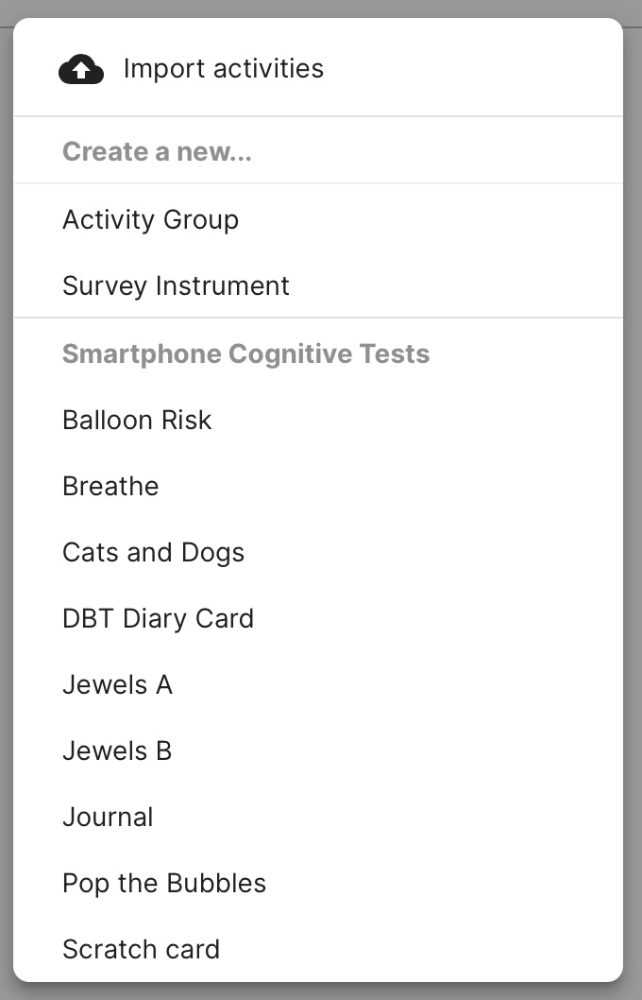
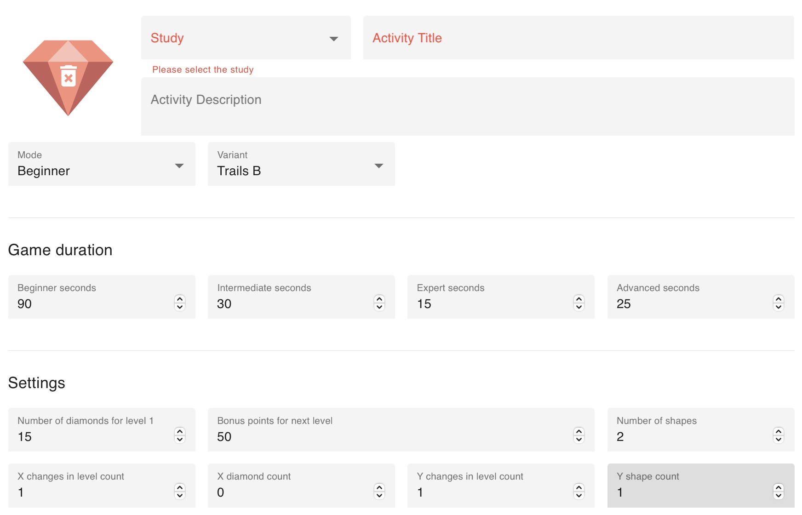
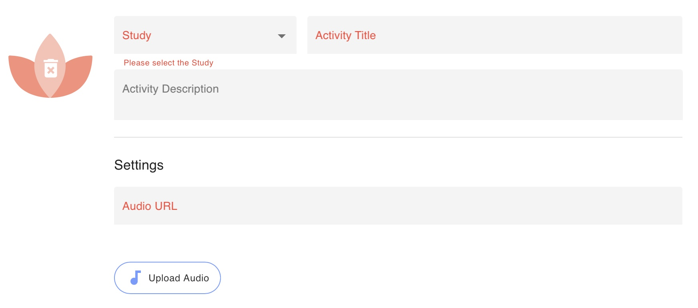
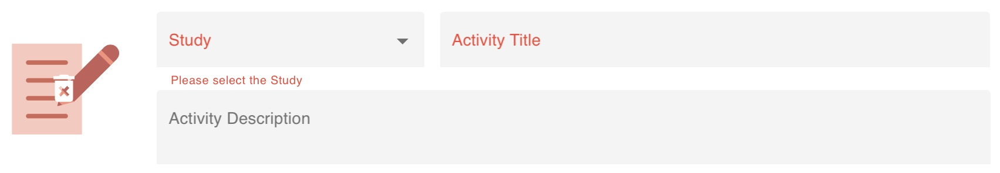
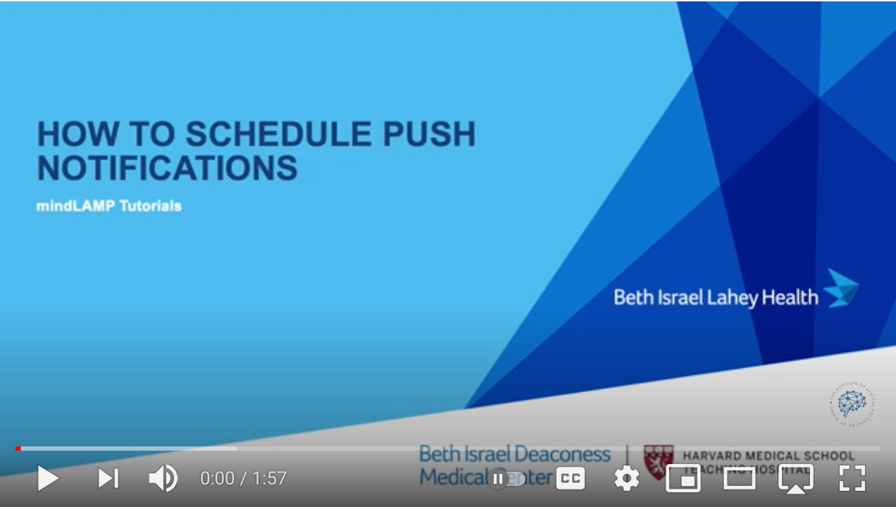

# Customize and Schedule Activities

To create any activity that shows up on the manage page (e.g. Jewels A or B):

1. Log in to the dashboard and navigate to the Activities tab.
2. Click the `[+ Add]` button at the top right of the list to begin.
3. Choose the activity you would like to add.
4. Select the study you wish to add it to.
5. Add a title.
6. Add a description if it is appropriate.
7. Add an icon by clicking on the camera icon and uploading your desired image.
8. Click Save to save your activity.
9. See some examples of different activities below.

### Some examples of activities you can customize:

Note: You are able to change the icon by clicking the trash can to delete the current one. From there follow the same steps as above for adding your own icon. Please note that any image you wish to upload must be less than 1mb in size and either a png, svg, or jpeg file type.

### Jewels A and Jewels B

For both Jewels A and Jewels B, you are able to input specifics such as game duration. You can also edit the number of diamonds, points, and shapes of the diamonds.

To edit any of these, simply click on the box and enter your desired number.

### Breathe (Mindfulness)

You are able to either copy a URL and paste it into a breathe activity, or you can upload a previously recorded audio file by selecting "Upload Audio" and importing it.

### Journal

Once you create your journal activity, it will show up in the Manage tab. However, you are only able to view the results in the Prevent tab.

# Scheduling an Activity

1. Log into the dashboard and navigate to the Activities tab.
2. Select the activity you would like to schedule by checking the box next to it's name.
3. Click the arrow to the right of the Name.
4. Click the plus sign to the far right to add a schedule.
5. Select you Start Date, Time, Repeat Interval, etc.
6. Click the check mark.
7. The patient or participant will receive a feed item and a notification on their phone at the specified time.

*How to schedule an activity from the Patient Profile*
