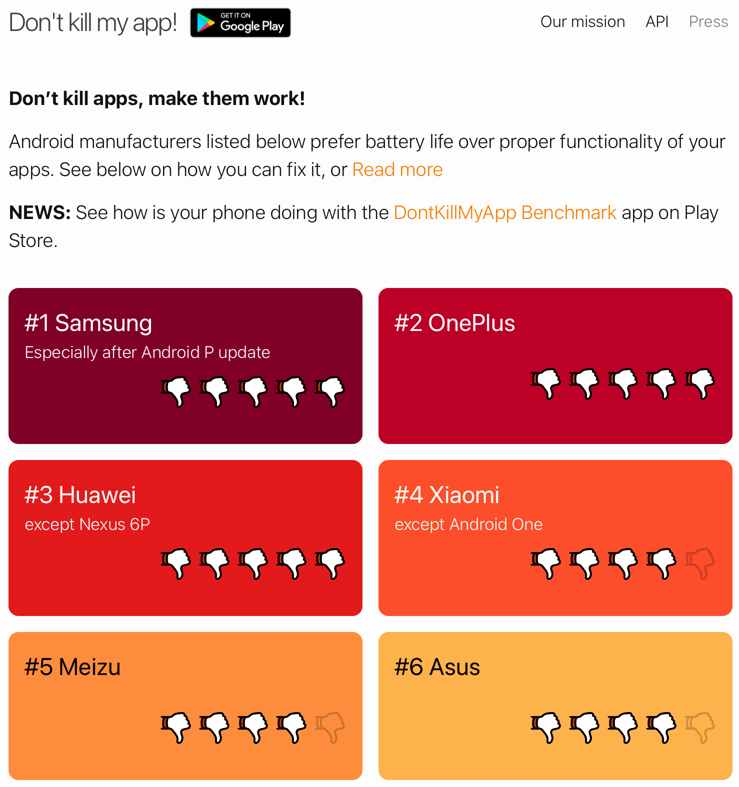

# [Android] Don't Kill My App!

Read more at [https://dontkillmyapp.com](https://dontkillmyapp.com/)

> **UPDATE 2021:** Despite Android team's promise to enforce OEMs to be transparent about non-standard app killing, in Android 11 **Samsung has introduced a new severe (default ON) restriction**. Apps can no longer hold wake lock in foreground services. This breaks many use-cases, for instance **health apps are now unable to gather sensoric data for their users**.

**For best results when using the mindLAMP app on Samsung, OnePlus, Huawei, and Xiaomi devices, please visit the Don't Kill My App website and follow the recommendations listed.** 

The mindLAMP smartphone and wearable apps apply all best practices to ensure that data is collected as robustly as possible, but there are some cases where you may need to intervene and configure your device correctly.
