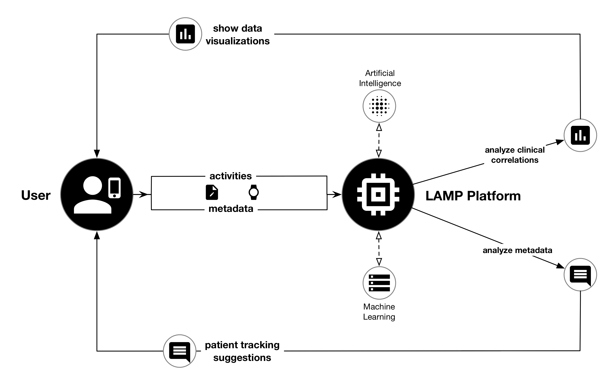
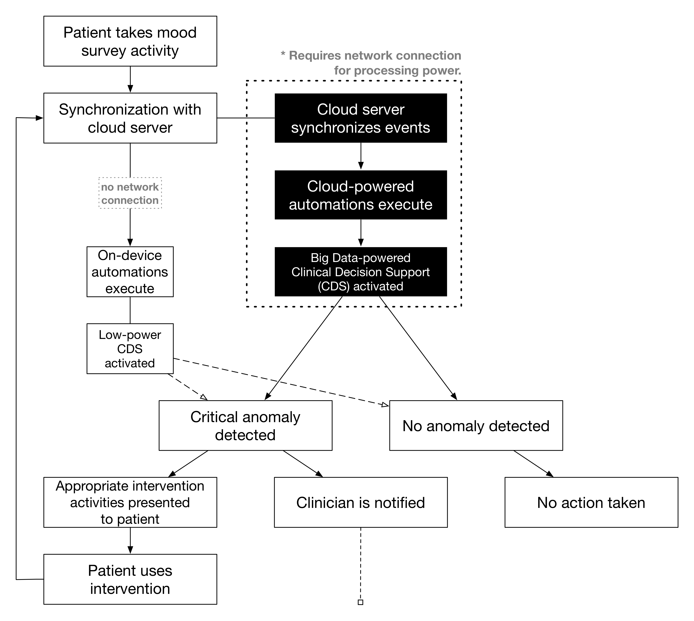

# Continuous Monitoring & Intervention Delivery

The primary goal of the LAMP Platform remains the integration of continuous monitoring and rapid intervention delivery. Using the various components of the Platform with the mindLAMP app as an interface could suffice in most situations — processing power and battery life unconstrained, as well as constant access to network resources and the results of the processing from a Cloud server. As a Participant actively enrolled in a study uses the app, including interacting with Activities available therein, sensor instruments periodically collect measurements in the background. These data are submitted to the Cloud server which notifies and activates the correct set of Automations in the right order. These could include Visualizations, Predictive Models, or Clinical Decision Support systems that were installed by the Researcher supervising that Participant’s study.

[Please contact us directly for guidance on delivery of just-in-time interventions.](mailto:team@digitalpsych.org)

Taking the example of a Big Data-powered Clinical Decision Support (CDS) system, it may ingest a vast amount of passive as well as active data to apply heuristics and derive extracted meta-information, upon which machine learning analysis may detect a critical anomaly requiring clinical intervention and support. After notifying the clinician, this system may notify the Participant with an intervention Activity. As the Participant interacts with the newly suggested intervention, newly recorded measurements from the aforementioned sensor instruments will be synchronized to the Cloud server, and this same CDS system will be invoked again to verify that how successful the feedback was.

Supposing a Participant were not able to remain connected to the network frequently, the mindLAMP app may not be able to communicate with the Cloud server responsible for managing the execution of these Automations. Instead, however, a “low-connectivity” mode is entered, and of all the Automations installed by the Researcher, those specifically designated as capable of low-power processing (and written only in JavaScript, accessing no network or disk resources) will be downloaded and version-synchronized whenever possible. It is this lightweight version of the CDS system that will instead be executed, but the same intervention Activity will be presented to the Participant in the same timely manner. This version of the CDS system might instead rely only on simple heuristic such as the value of a single question related to suicidal ideation, as the processing scale of the Big data-powered variant CDS system would be dramatically greater and unsupportable on smartphone devices.
