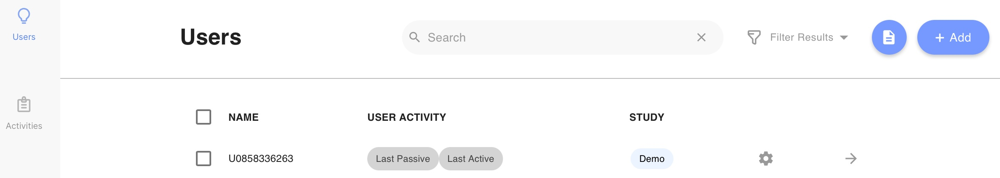
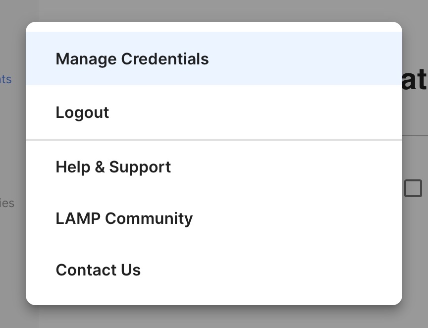
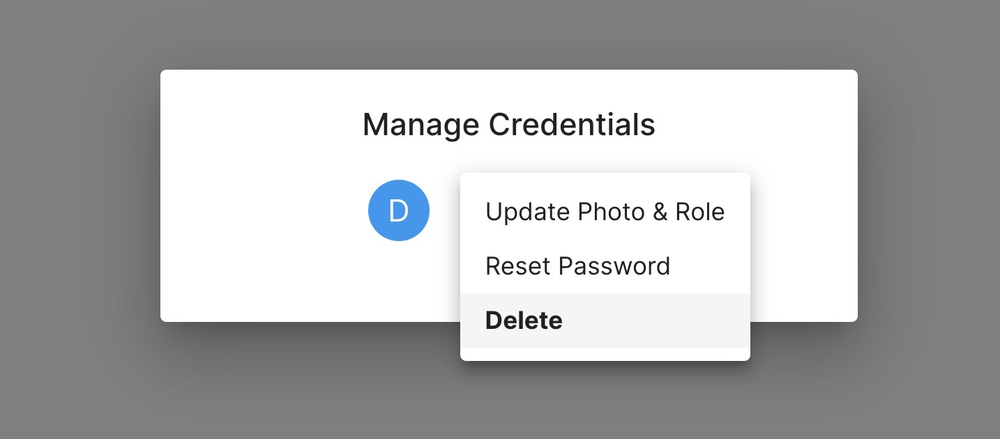

## Logging In

1. Open your preferred browser (Google Chrome, Firefox, Safari, Internet Explorer 11+ recommended).
2. Navigate to [https://dashboard.lamp.digital](https://dashboard.lamp.digital).
3. Enter your username and password.
4. Select "Login."

## Create a New Researcher or Clinician Credential (Admins Only)

1. Log into the app and click on the "Users" tab.
2. Tap the profile icon at top left in the blue bar and select the Manage Credentials option from the drop-down list. 
3. Tap the `[+]` icon and enter only: **Name, Email Address, and Password.** You can ignore the **Image** and **Role** field.
4. Click the check mark to save your credential.

Note that the email address you provide **MUST NOT** already be used across any credentials in your instance of the LAMP Platform. If the email address specified is already taken, your credential will fail to be created.

The **Name** field of your very first credential will always be reset to `Default Credential`. 

## Reset a Clinican's or Researcher's Password (Admins Only)

1. Log into the app and click on the "Users" tab.
2. Tap the profile icon at top right and select the Manage Credentials option from the drop-down list. 
3. Tap the credential whose password you wish to change
4. Enter the password and tap the check mark icon at the right side of the text box to save your new password.

**DO NOT** attempt to reset the password of the credential you are currently using to log into and access mindLAMP. This may prevent you from using the app and lock you out.

## Delete an Existing Clinician or Researcher Credential (Admins Only)

1. Log into the app and click on the "Users" tab.
2. Tap the profile icon at top right and select the Manage Credentials option from the drop-down list. 
3. To delete a credential that already exists, tap its icon and select the `Delete` option from the drop-down list.

Please note that this only deletes only the access to data, not the data itself; deleting an object and deleting a credential are different in the LAMP Platform. If no credentials remain, then there is no way to log in from the mindLAMP app.

## Change a Clinician or Researcher Log In Email (Admins Only)

To change a log in email for a clinician, you must create a new credential and delete the old one.

1. Log into the app and click on the "Users" tab.
2. Tap the profile icon at top right and select the Manage Credentials option from the drop-down list. 
3. Tap the `[+]` icon and enter only: **Name, Email Address, and Password.** You can ignore the **Image** and **Role** field.
4. Click the check mark to save your credential.
5. Again, tap the profile icon at top right and select the Manage Credentials option from the drop-down list. 
6. To delete the old credential, tap its icon and select the `Delete` option from the drop-down list.

**If you are locked out of your account, please consult your clinician or system administrator/your organization's IT department for assistance.**

## Sharing the QR Code and Log in Link for an Established Patient.

1. Log into the app and click on the "Users" tab.
2. Check the box next to the patient’s name.
3. Click on the “Edit Password” option.
4. Change the password.
5. Click on the floppy disk icon and the QR code will appear underneath the text field.

## Clinician vs Patient Credentials

Managing credentials for yourself or others is as follows:

- **I am a clinician or researcher and  want to manage my own credentials.**
    - Tap the profile icon at top right and select the Manage Credentials option from the drop-down list.

- I am a clinician or researcher and want to **manage the credentials of a patient or participant.**
    - Tap the Edit Password after checking the patient's name.

Want to manage your current patients? See [Create or Manage Users](Create_or_Manage_Users.md) 
