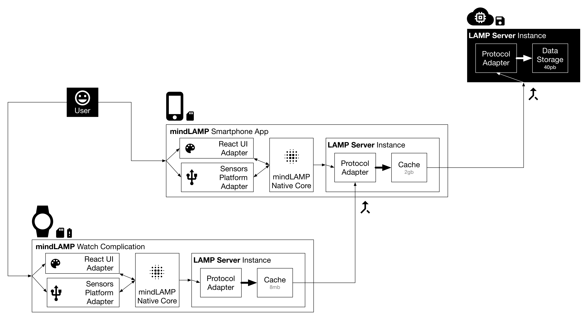

The LAMP Platform API Server encompasses two main purposes:

1. Communicate via the LAMP protocol as an API to any participating clients, and
2. store data in the LAMP protocol data format.

As the client of the API Server need not worry about the data storage, the semantics of how the data is stored as well as where, or for how long, are transparent and are subject to change in real-time. As long as the client uses the API, all storage access is transparently cached, proxied, or retrieved from a pre-specified medium.

In proxy mode, an instance of the API Server can continue to vend the API without being attached to permanent/long-term storage. This process requires:

1. A data cache,
2. a connection to another instance of the LAMP server, and
3. periodic synchronization between (1) and (2) determined by an availability factor.

    

The proxy mode use-case of the LAMP server enables chaining instances together for accumulative data transfer. This serves useful for several reasons:

1. Network availability no longer impacts the API client as long as sufficient storage space is available for caching.
2. ActivitySpec updates (that is, when the code underlying a cognitive test or intervention, for example, is updated) are automatically propogated to all instances downstream of the first non-proxy instance when synchronization occurs. Thus, an "application update" not involving the native code of the API client occurs transparently.
3. Connectivity method is not specifically defined; though it becomes the concern of the specific instance, it allows for flexibility of transfer between WiFi, bluetooth, LTE, etc. as needed or as capable by the hardware.

As battery and storage size are concerns that impact the overall cost of a smartphone as well as how often it must be charged, patients with lower economic ability, for example, may not be able to sustain high frequency sensor collection while simultaneously lacking consistent network connectivity.

By both lowering the collection frequency of sensors and running an app-local instance of the LAMP server configured in proxy mode, patients will be able to use the same app, automations, and interventions, at a lower but still acceptable fidelity while incurring less battery and storage penalty.

In contrast, even in capable devices and well-equipped environments, recording high frequency sensor data from multiple devices still require coordination. Patients would be able to configure the smartwatch instance in proxy mode to connect to the smartphone instance, which itself would be configured in proxy mode to connect to an instance of the LAMP server in the cloud. This daisy-chaining of instances allows the smartphone instance of the LAMP server to effectively "see" the data from the smartwatch instance and be able to perform actions in response to it.

## Limitations & Strategies

While a server instance in proxy mode appears transparent to any clients, there are a few concerns followed by mitigations thereof:

1. **origination:** data cached and transferred through several instances in proxy mode would lose meaningful tagging of origin (i.e. from a wearable with high accuracy sensors or a smartphone with low accuracy sensors).
    1. the use of an API key carries origination information encoded as a JWT (JSON Web Token) for all clients irrespective of which server instance they choose to communicate with.
    2. LAMP server instances must only brand their origination upon data if none exists already.
2. **timestamp invalidity:** though the root instance of a LAMP server may be geolocated in the EST (U.S. East) time zone, it may be synchronizing with instances configured in proxy mode geolocated in the IST (Indian) time zone.
    1. LAMP server instances convert timestamps into the GMT (+0) time zone upon receipt from the client.
    2. upon client data access, the LAMP server re-converts timestamps into the local time zone (as specified by an IP address, for example) or the time zone requested by the client.
3. **automation support:** intensive automations such as those written in Python or R cannot be invoked without network availability at the root instance.
    1. some automations, when marked as "lightweight" and written in a supported language, such as Javascript, may be locally cached and invoked on-schedule to facilitate critical and vital functions (i.e. intervention deployment dependent on reported suicidal ideation).
4. **synchronization of non-timestamp-marked data:** update or creation actions on non-event data cannot be synchronized or merged.
    1. such actions can be considered completed by the proxy mode instance but will be queued for synchronization with a timestamp; if the root instance rejects the action, the local proxy mode instance will be reconciled with the most recent data.
5. **Activity deployment-notification and scheduling:** a push notification to deploy an Activity to a patient at the current instance (that is, not a scheduled one) may not succeed if the root instance does not synchronize with the proxy mode instance, and specifically targeting one instance may not be possible (such as the proxy mode instance running on a smartphone instead of on a wearable device, which is unsuitable for interaction).
    1. the API key (that is, the origination as explained above) of a suitable client can optionally be specified when pushing a notification; such notifications will remain queued at the root instance until downstream synchronization reaches the correct proxy mode instance.
    2. if no origination is required, the first available proxy mode instance with the applicable ActivitySpec will consume the notification and dequeue it (preventing downstream instances from knowing it was ever present).
