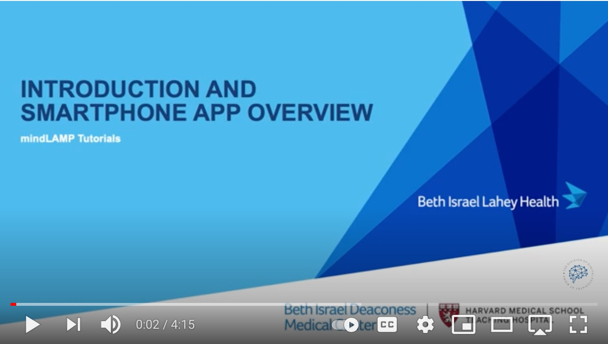
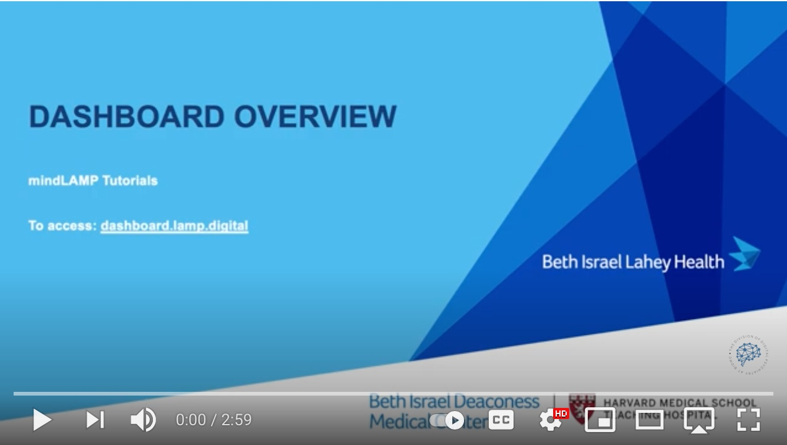

# How does the mindLAMP App Work?

# How does the LAMP Dashboard Work?

# What can I Customize to my Study or Clinic?
You are able to customize tips in Learn, surveys in Assess, activities in Assess and Manage, and potentially visualizations in Prevent.
