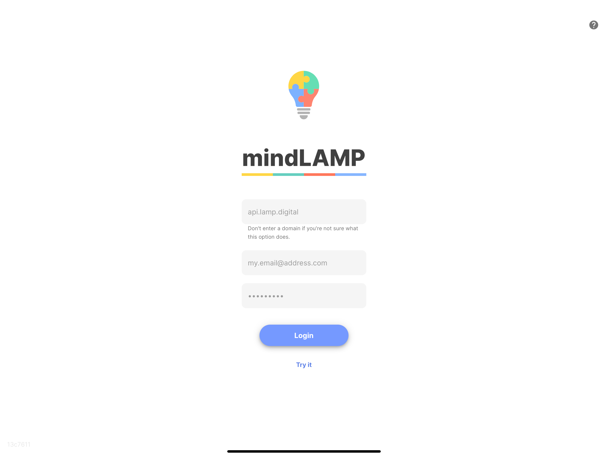
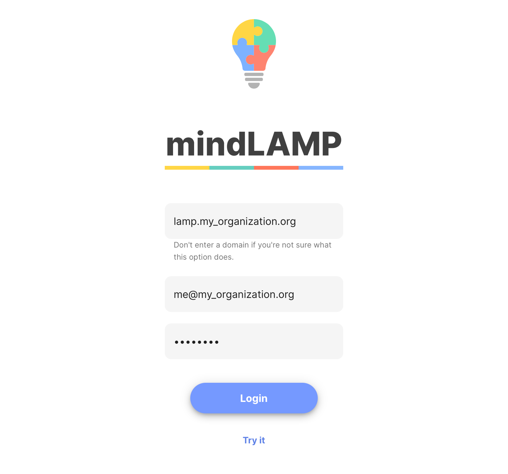
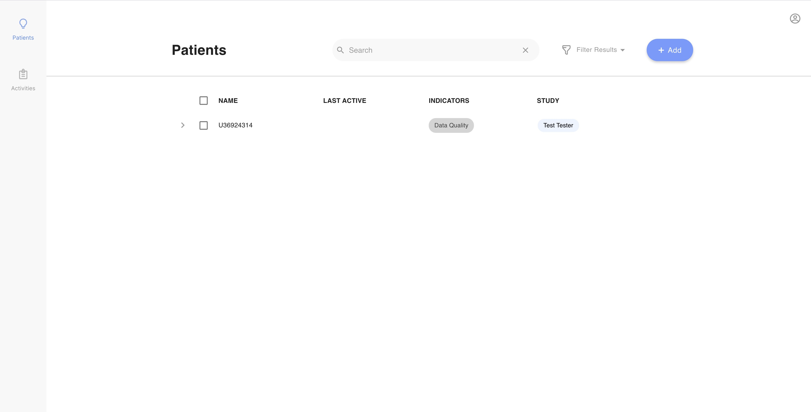

# Accessing Your Account

### Step 1: Open your phone or desktop browser and navigate to the mindLAMP app.

The app is available at `[https://dashboard.lamp.digital/](https://dashboard.lamp.digital/)` — consider bookmarking it so you don't forget.

Please note that LAMP requires at least Android 7 minimum and soon will require iOS 14 minimum to run on a smartphone.

### Step 2: Log in with your credentials.

If you do not have a username and password assigned to you, please contact your systems administrator or IT department.

If you or your organization doesn't yet have access to mindLAMP, but would like to try it out first, you can tap `[Try It]` below the login button.

If no domain was specified by your IT systems administrator, you can leave that field blank ("lamp.my_organization.org" is only for this example).

For more instructions around logging in, see [Log In Information, Tips, and Tricks](Log%20In%20Information,%20Tips,%20and%20Tricks.md) 

### Step 3: See what the Dashboard looks like for patients or participants.

To learn more about what you can see here, visit [View the Dashboard](View%20the%20Dashboard.md).

---

**Was there something we didn't cover, or need more help?**
Let us know by making a post in the [LAMP Community](https://community.lamp.digital/), or [contact us directly](mailto:team@digitalpsych.org). Thank you for your contribution! 🌟
*Page last updated on October 28th, 2020.*