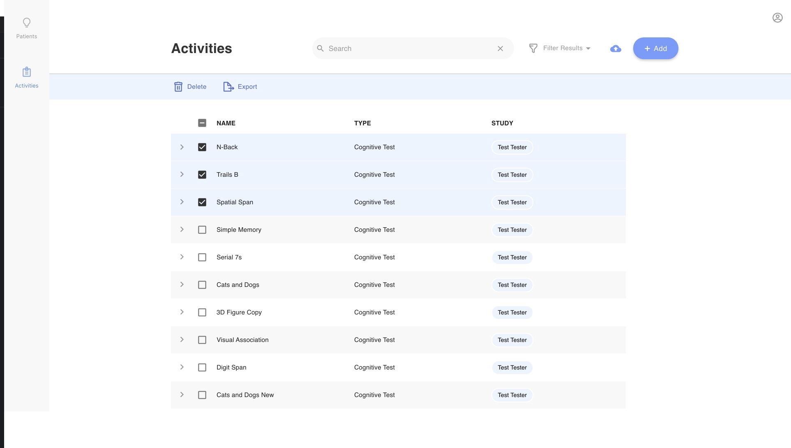
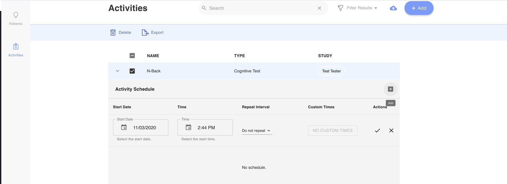

# Delete and Schedule Surveys

Check out [Importing, Exporting, and Duplicating Activities](Importing, Exporting, and Duplicating Activities.md).

Look at  [Create Activities](Create Activities.md) to add some tips or cognitive tests to your Activities tab!

# Delete an Existing Survey Instrument.

1. Log into the dashboard and navigate to the Activities tab.
2. Select one or more survey instruments you would like to delete.
3. Press Delete/the trash can icon at the top of the list.

    **All data saved under that survey activity is deleted for every patient in your clinic.** 
    Once deleted, a survey activity and any deleted data cannot be recovered. 

Trying to delete or edit responses to a survey? Check out [Visualize data](../Visualize data.md) and go to step 3!

# Scheduling a Survey

1. Log into the dashboard and navigate to the Activities tab.
2. Select the survey instrument you would like to schedule.
3. Click the arrow to the right of the Name.
4. Click the plus sign to the far right to add a schedule.
5. Select you Start Date, Time, Repeat Interval, etc.
6. Click the check mark.
7. The patient or participant will receive a feed item and a notification on their phone at the specified time.

Ready to start [Take Surveys and Complete Activities](Take Surveys and Complete Activities.md)?