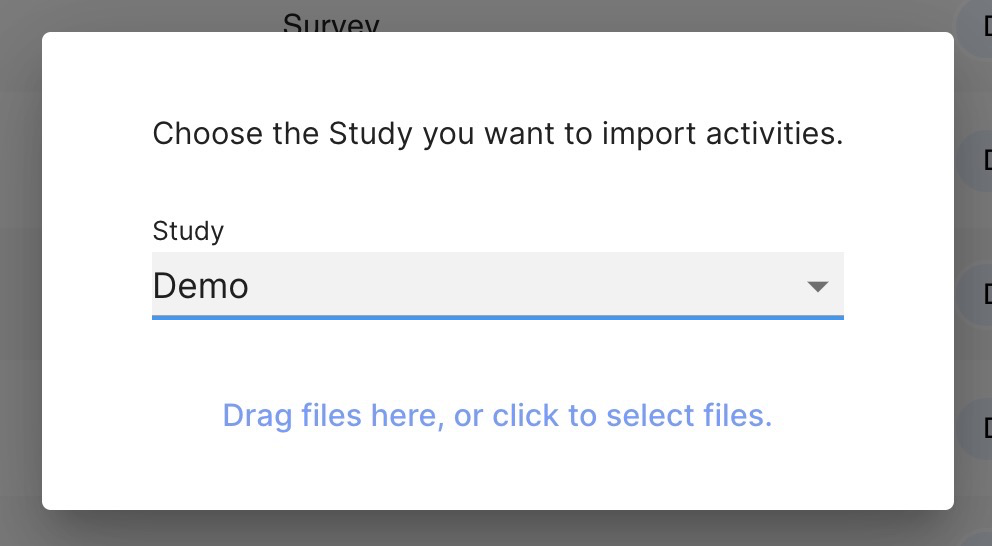

# Importing, Exporting, and Duplicating Activities

### Exporting Your Activities

If you’d like to share your clinic or research study’s Activity setup such as survey instruments, groups, and other items, tap the checkboxes of one or more Activities you would like to share and tap the export button at the top right of the list. A file will be downloaded that you can share via email, for example. 

1. Log into the dashboard and navigate to the Activities tab.
2. Select one or more survey instruments you would like to share.
3. Press Export at the top of the list.

    

If you’re a clinic administrator and would like to ensure that all the clinics you manage are using the most recent versions of some assessments, this method allows you to quickly synchronize different clinics.

If you’re a researcher and would like to ensure that your research study is reproducible when publishing data that uses the LAMP Platform, provide this exported file as a supplemental material for others to use.

### Importing Activities

1. Log into the dashboard and navigate to the Activities tab.
2. Click "Add", then select the import/cloud with an arrow in its icon.
3. Select the study you wish to import the survey or activities to.
4. Drag or select the file to load its contents; an error will be displayed if an invalid file is uploaded.
5. Tap the `[Import]` button, these survey instruments and groups will be copied into your clinic.

### **Duplicating an Existing Activity (Surveys Only)**

1. Navigate to the activities tab.
2. Click on the survey you wish to edit.
3. Change the title of the survey.
4. Make your desired changes.
5. Click “Duplicate.”

If you’re a clinic administrator and would like to ensure that all the clinics you manage are using the most recent versions of some assessments, this method allows you to quickly synchronize different clinics.

Ready to [Take Surveys and Complete Activities](Take Surveys and Complete Activities.md)?