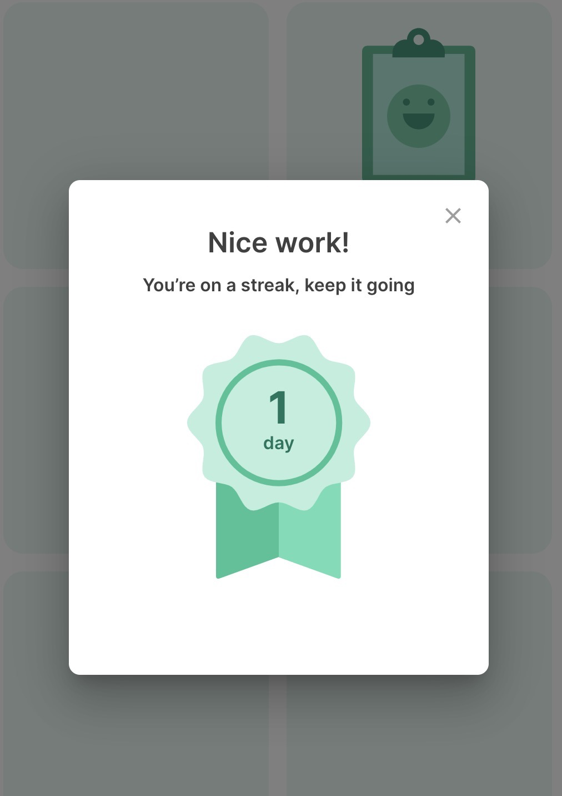

# Take Surveys and Complete Activities

### Step 1: View your Feed.

Now that you've logged into mindLAMP, you'll immediately see the Feed. Along the tab bar, you'll find buttons that link you to all the things you can do within mindLAMP. They're organized into the following sections:

1. **Learn:** You may find helpful tips to apply to your lifestyle here.
2. **Assess:** You'll find check-in surveys and games to play here.
3. **Manage:** You'll find relaxing activities to clear your headspace here.
4. **Prevent:** You'll find resources to help receive care and manage your symptoms here.

In the Prevent tab you'll find data visualization tools. To learn more about your data and how you can view it, see [Visualize data](../Visualize data.md).

### Step 2: Take a survey or use a relaxing Activity.

When you tap one of the buttons, you'll be taken to a full-screen Activity. One example is the breathe exercise in the **Manage** section (shown below), but you can also try taking surveys from the **Assess** section (shown below). 

Please note that some survey instruments can contain description information along with option anchors, as shown in the image below. 

Surveys with many questions and options are **best taken on desktop, laptop, or tablet computers** as they could be difficult to answer when taken on a mobile device. 

_(2nd_generation)_-_2020-10-02_at_14.22.05.png)

Each day that a survey or activity is completed, an encouraging streak tracker will pop up showing the number of days in a row that the patient has take the survey or completed the activity. This streak tracker is unique for surveys and activities. In other words, if a patient completes a mood tracker survey for seven days in a row and an anxiety survey for five days, their respective streak pop ups will show different numbers.

Want to see your survey results? Go to [View the Dashboard](../View the Dashboard.md)!

---

**Was there something we didn't cover, or need more help?**
Let us know by making a post in the [LAMP Community](https://community.lamp.digital/), or [contact us directly](mailto:team@digitalpsych.org). Thank you for your contribution! 🌟
*Page last updated on October 28th, 2020.*