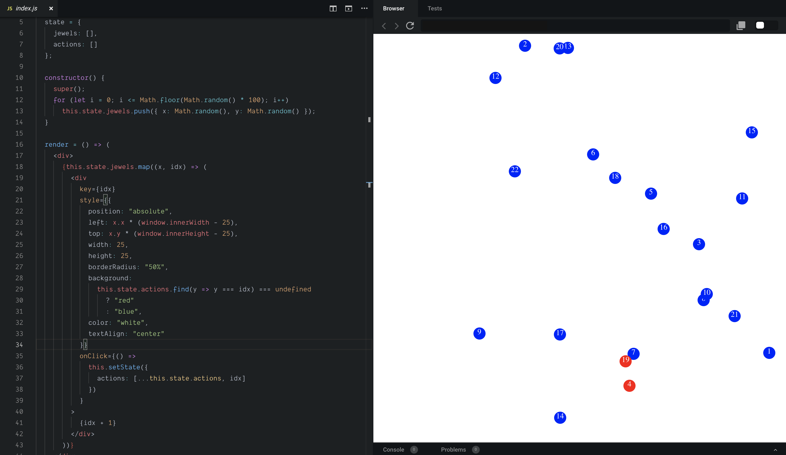
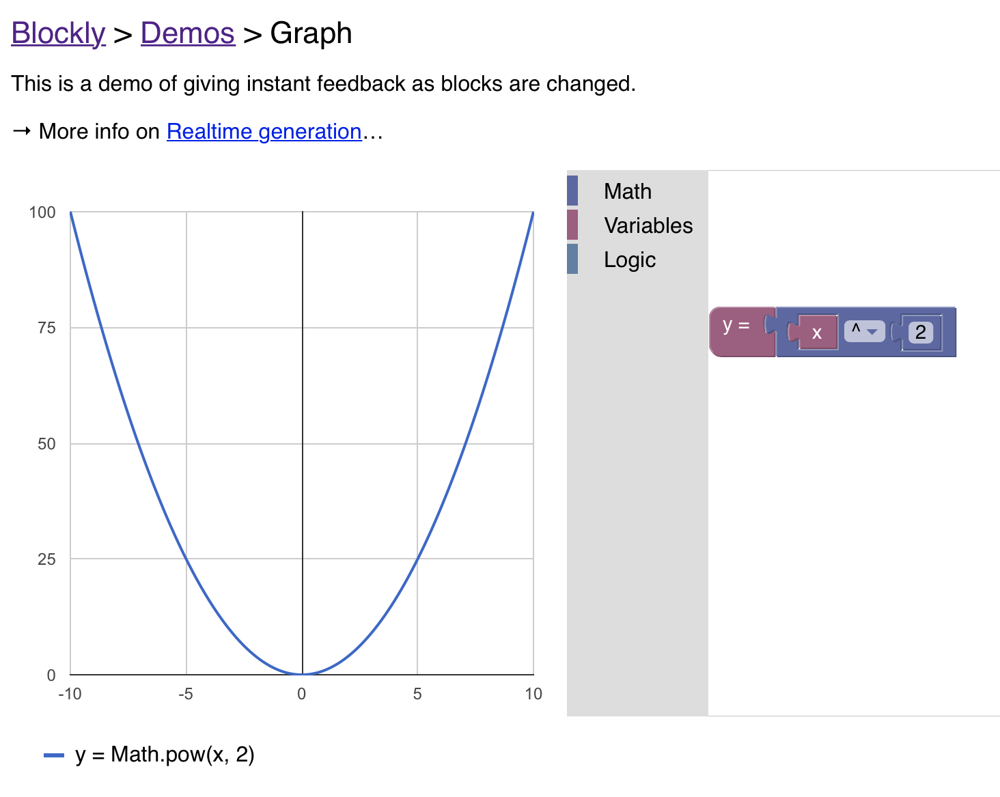

# Building New Activities

Because the **LAMP Platform** is built around around a simple native core and a flexible WebView UI, any HTML/CSS/JavaScript code that works in a browser can work in the app.

Learning modules, surveys, cognitive tests, and interventions all use the same API and using a framework such as React makes it simple, for example, to create new interventions as needed with patient/participant feedback.

Any Javascript-based code can be added the LAMP Platform using the ActivitySpec API, as long as it uses `window.postMessage()` and `window.addEventListener()` API to receive the Activity settings and submit the ActivityEvent once complete. 

---

**Figure 1:** Approximately ~40 lines of JavaScript + React code, shown on the left, produces a naïve implementation of the Jewels game, shown on the right.

If you'd like to try creating your own, but don't have a ReactJS development environment, **consider using [CodeSandbox](https://codesandbox.io/)**, a free service.

---

**Figure 2:** Using a variant of Blockly, developed by Google and used by the MIT Scratch language, we can drag-and-drop blocks to generate JavaScript code behind the scenes.

