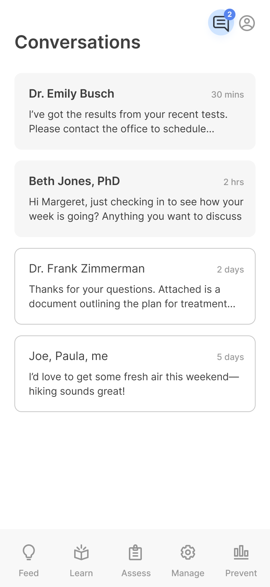
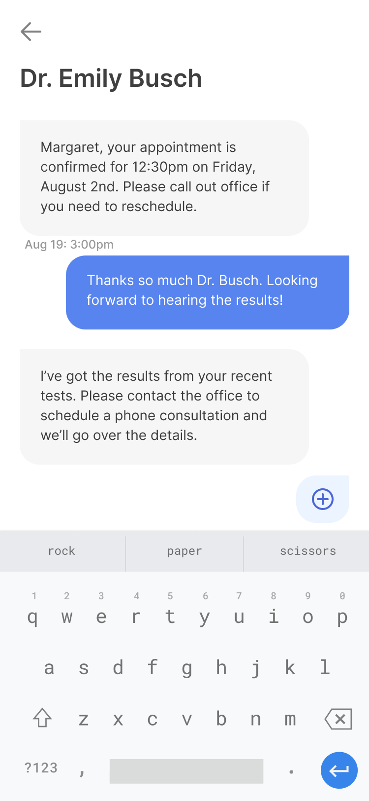

# Care Team - Connection with Patients

### Step 1: Understanding the care team and messaging feature.

In some cases, you may want to use mindLAMP to connect with patients and/or create virtual care teams or allow patients to create peer support networks. 

**These features are optional** and must be enabled by your server administrator before clinicians and patients can see or access them. 

Clinicians and server administrators **MUST** ensure that proper consent, safety planning, and documented procedures are in place before using these features.

### Step 2: Start conversations with patients.

mindLAMP allows for asynchronous messaging in the form of "group chats" between the clinician and patient, as well as anyone on the virtual care team or peer support network. Feedback from patients and high quality research supports that allowing patients to interact with care teams through messaging can be both therapeutic as well as a key driver of engagement in research studies or clinics. However, before using the messaging feature available in mindLAMP, it is **CRITICAL** to ensure that clear expectations are set around how messages will be responded to and what will happen in an emergency. 

**You should consult** with your organization's legal department, or Institutional Review Board (IRB), **BEFORE** communicating with patients or participants through mindLAMP.

### Step 3: Create a virtual care team or a peer support network.

Creating a virtual care team is easy in mindLAMP. As many care team members as required can be added by simply clicking the red `(+)` bubble to the right of the patient's `(ME)`bubble. The patient's `(ME)` bubble will always remain at the center. 

Once you have added an individual to the care team, that individual will have **full access** to the mindLAMP dashboard for the patient, as well as **all conversation history**, with the **ability to participate** in existing or new conversations. 

Examples of team members could include...

- **therapists**
- **social workers**
- **family members**
- **physicians**
- **pharmacists**
- **trusted peers**

...and more. 

---

**Was there something we didn't cover, or need more help?**
Let us know by making a post in the [LAMP Community](https://community.lamp.digital/), or [contact us directly](mailto:team@digitalpsych.org). Thank you for your contribution! 🌟
*Page last updated on October 29th, 2020.*