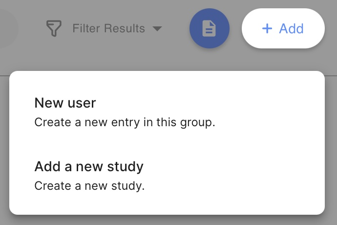
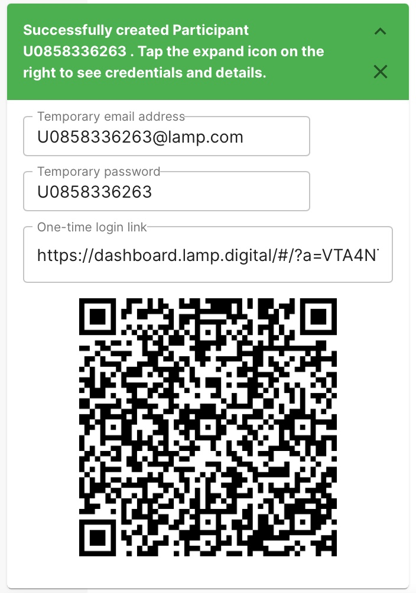
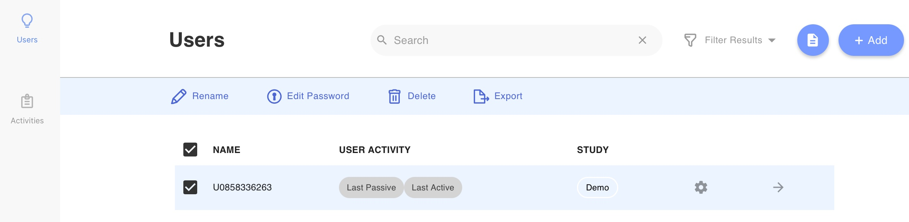
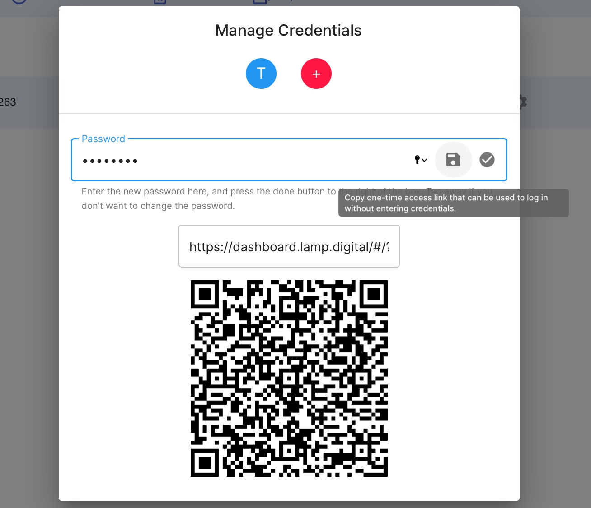
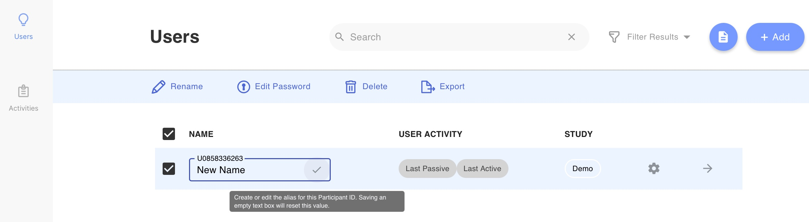
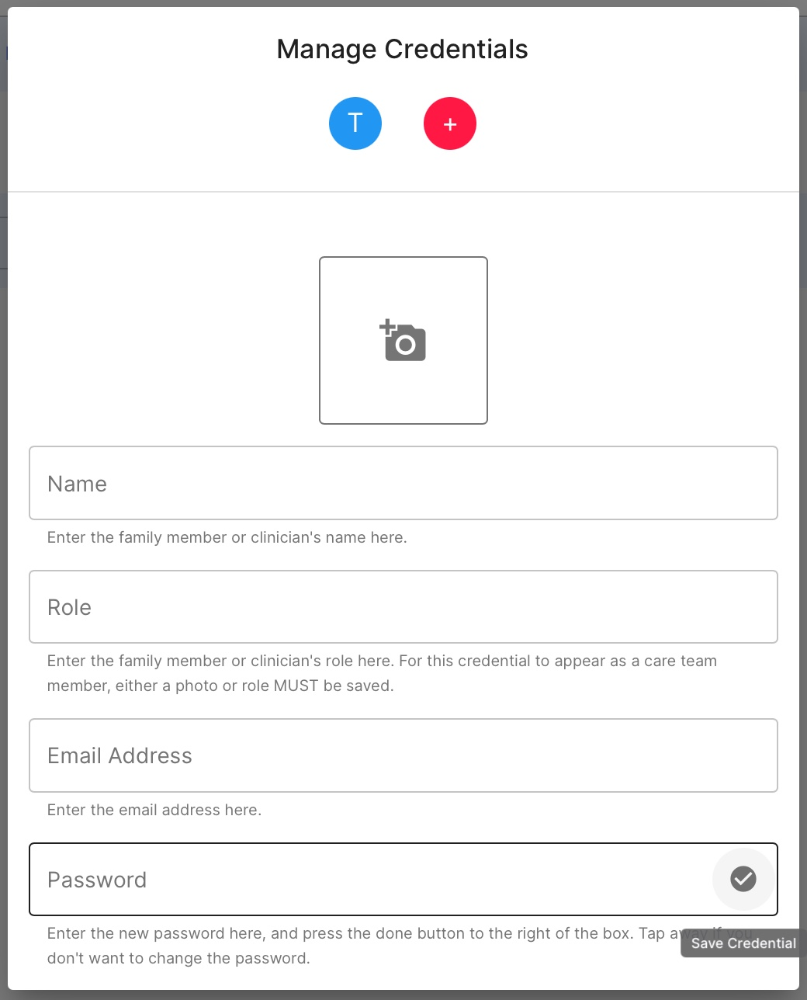
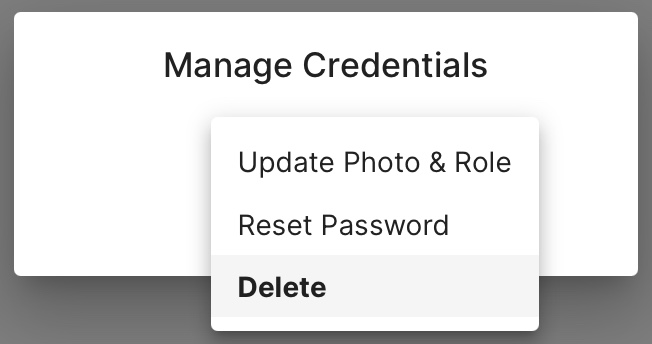
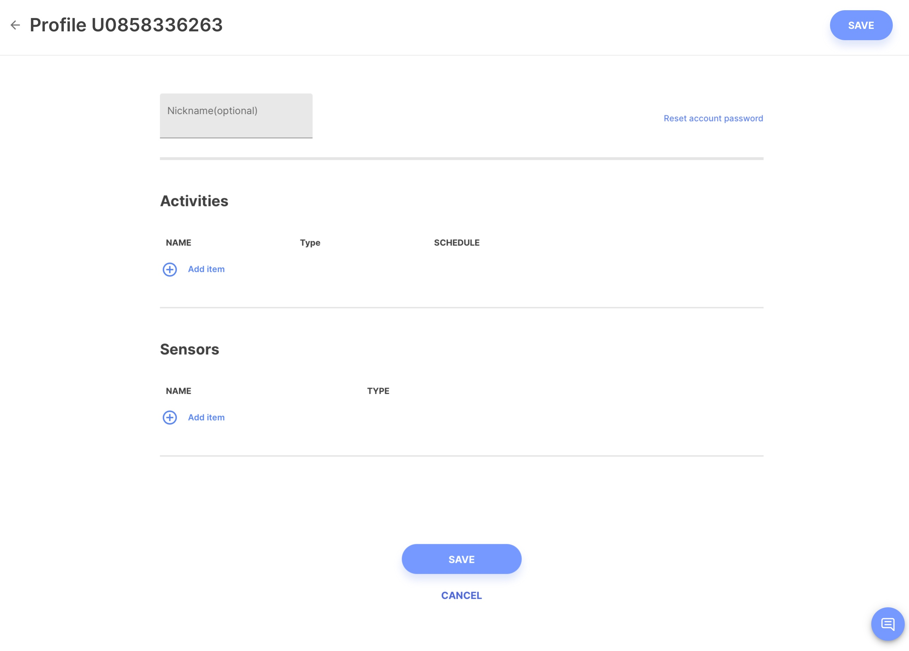
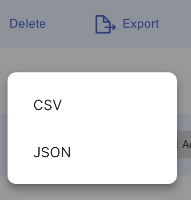

### Creating a New Patient or Participant

1. Log into the app and click on the "Users" tab.
2. Tap the profile icon at top right and select the Manage Credentials option from the drop-down list. 
3. Tap the `[+]` button at the top right of the list; you will be prompted with a counter for the number of patients/participants to add, as you may want to create more than one at a time.
4. Once you create a patient, you will have the opportunity to input an email address and password. This does **not** need to be a real email. You can make the email anything you'd like (e.g. patient@xyz.com).

When created initially, these patients/participants won’t have an associated de-identification alias or an account to login to mindLAMP with themselves. To allow patients to access mindLAMP themselves on a desktop or mobile device, **see** [Log In Information, Tips, and Tricks](Log%20In%20Information,%20Tips,%20and%20Tricks.md)

### Sharing the QR Code and Log in Link for an Established Patient

1. Log into the app and click on the "Users" tab.
2. Check the box next to the patient's name.
3. Select the **Edit Password** option.
4. Click on the floopy disk icon and the QR code will appear underneath the text field.

### Rename a Patient

For each patient/participant in the list on this screen, you’ll see an outlined text box containing their de-identified patient identifier, typically beginning with a `U`, followed by a random number of random digits. 

It is not recommended to use full names or other identifying text when referring to patients instead of their patient identifier as this increases your liability and and risk when **complying with HIPAA, COPPA, GDPR, or other federal regulations.**

1. Log into the app and click on the "Users" tab.
2. Check the box next to the patient's name.
3. Tap **Rename** to add, edit, or remove the de-identification alias. 
4. Tap outside of the text box or press the check mark icon at the right side of the text box. You will now see the patient/participant’s identifier as mini hovering text above the text box.

Though it appears that the patient has been “renamed,” this new alias is only visible to you, as a clinician or researcher, and not to the user, or anywhere in the data when saved or exported. 

### Delete Existing Patients or Participants

1. Log into the app and click on the "Users" tab.
2. Select one or more patients/participants by tapping the checkboxes at the left of their row. 
3. Tap the delete icon and confirm your selection. 

**All data associated with the patients/participants being deleted are irrecoverable and will be lost.** Please exercise caution when deleting patients and confirm your selection to avoid permanent data loss. 

### Reset a Patient's Password

1. Log into the app and click on the "Users" tab.
2. Select the checkbox next to the patient whose credentials you wish to change.
3. Select **Edit Password.**
4. Select the credential you wish to change and click **Reset Password.**
5. Enter your new password and select the circled check mark to save it.

### Reset a Patient's Login Credentials

1. Log into the app and click on the "Users" tab.
2. Select the checkbox next to the patient whose credentials you wish to change.
3. Select **Edit Password.**
4. Select the plus button and enter the new credential (email and password).
5. Click the circled check mark to save the new credential.
6. Delete the old credential.

### Access the Patient Profile

1. Log into the app and click on the "Users" tab.
2. Select one or more patients/participants by tapping the checkboxes at the left of their row. 
3. Click the gear icon.
4. Rename, reset password, modify activities or sensors, or send a message to the patient.
5. Click "Save."

### Export Data for Multiple Patients/Participants

1. Log into the app and click on the "Users" tab.
2. Select one or more patients/participants by tapping the checkboxes at the left of their row. 
3. Tap the Export icon at the top right of the list. You’ll be prompted with a menu to select `CSV` or `JSON`, a file will be downloaded. 

Please note the following: 

- `CSV` is a two-dimensional tabular file format that is supported by many common spreadsheet applications such as Microsoft Excel, as well as most data analysis programming environments, including R, Python, MATLAB, and SPSS.
- `JSON` is a multidimensional structured file format that is typically only supported by application programming environments such as `R`, `Python`, or `Javascript`.

We recommend the structured `JSON` export option wherever possible, as the LAMP Platform processes and harmonizes your data automatically for you. Selecting `CSV` will disable these optimizations and may require you to manually process your data yourself.

To learn more about sending patients or participants surveys check out [Create Surveys](Activities%20Tips,%20Surveys,%20and%20Cognitive%20Tests/Create%20Surveys.md).
