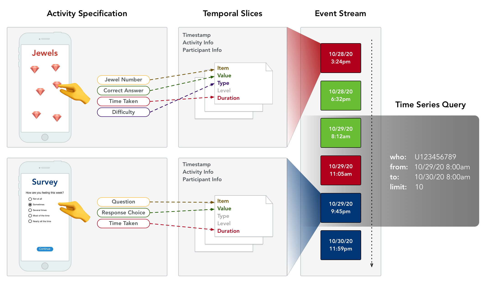

# How does the LAMP data format work?



**→** [Learn more about the API that powers the LAMP Platform and the Cortex pipeline.](Data%20Science%20with%20LAMP.md)

## ① 
Activity Specification

---

Each activity that patients/participants can interact with is defined and encapsulated in an **ActivitySpec** that contains the applet (written in HTML), along with a schema to describe the input and output data. 

---

## ② 
Temporal Slices

---

When a patient begins an interactive session with any activity, session-wide data about who, what, and when is recorded. Each user tap within is then automatically validated and converted into a time-indexed standardized format called a **TemporalSlice**. 

---

This means data processing code can be written just once and work for any activity or any user.

## ③ 
Event Stream

---

When the user completes the interactive session, all the **TemporalSlice**s are packaged into chronologically ordered **ActivityEvent**s indexed under the user's **Participant** object as a low-latency stream of continuously generated data.

---

## ④
Time Series Query

---

The researcher/data scientist can query this data at any desired temporal resolution (e.g. one millisecond, one day, one year, etc.) and filter by the type of activity (e.g. Survey, Jewels, etc.). The query can be [manipulated using map/reduce document transforms](Topics/Using%20Document%20Transformations.md) and listened to notify client code directly with real-time updates.

---

- Example JSONata

    ```bash
    // Get all participants
    $Participant_all("study").{ id, timestamp }

    // Get all activities
    $Activity_all("study").{ id, ... }

    // Get all activity events for all participants
    $Participant_all("study").$merge([$ActivityEvent_all(id), { "#parent": id }])[$exists(timestamp)]
    ```