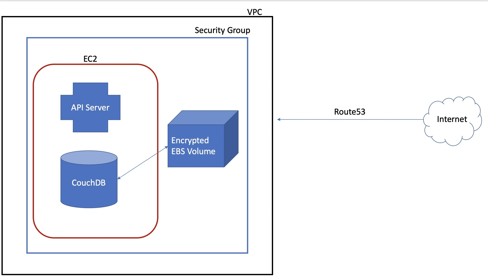

The following instructions will result in a Docker Swarm setup prepared to deploy LAMP. You will need to continue following the instructions after this phase to successfully configure LAMP.



Digital Psychiatry's AWS Network Diagram for the LAMP Platform

### For EC2 Instances Only:

**You must replace the value of `MY_DNS_NAME` in the commands below.**

```markdown
 1. Create an EC2 instance.
				-> AMI: AWS Linux 2
				-> Instance Type: [MINIMUM] t2.medium
				-> Create a new IAM role with the `AmazonSSMManagedInstanceCore` policy.
				-> Enable termination protection.
				-> Create a [RECOMMENDED] 1TB EBS volume WITH encryption enabled.
				-> Configure security group:
						-> HTTP: TCP 80 from anywhere
						-> HTTPS: TCP 443 from anywhere
						-> Docker Daemon: TCP 2375 from this Security Group
						-> Docker Machine: TCP 2376 from this Security Group
						-> Docker Swarm: TCP 2377 from this Security Group
						-> Docker Swarm: TCP 7946 from this Security Group
						-> Docker Swarm: UDP 7946 from this Security Group
						-> Docker Overlay: UDP 4789 from this Security Group
				-> Create a new key pair and keep it private.
				-> Allocate and assign an elastic IP to the instance.
 2. Run the following commands in the instance.
				sudo yum -y update && sudo yum -y install docker -y
				sudo usermod -a -G docker ec2-user
				sudo hostnamectl set-hostname <MY_DNS_NAME>
				sudo printf "[Service]\nExecStart=\nExecStart=/usr/bin/dockerd -H tcp://0.0.0.0:2375 -H fd:// --containerd=/run/containerd/containerd.sock\n" | sudo tee /etc/systemd/system/docker.service.d/override.conf
				sudo systemctl daemon-reload && sudo service docker restart
				sudo docker swarm init
 3. Create your DNS binding in Route53.
```

- **CloudFormation Stack**

    **This stack is a work-in-progress and should NOT be used for production needs.**

    ```yaml
    AWSTemplateFormatVersion: 2010-09-09
    Description: stuff
    Parameters:
      DomainName:
        Description: Domain name
        Type: String
      InstanceType:
        Description: EC2 instance type
        Type: String
        Default: t2.nano
        AllowedValues: [a1.2xlarge, a1.4xlarge, a1.large, a1.medium, a1.metal, 
        a1.xlarge, c1.medium, c1.xlarge, c3.2xlarge, c3.4xlarge, c3.8xlarge, 
        c3.large, c3.xlarge, c4.2xlarge, c4.4xlarge, c4.8xlarge, c4.large, c4.xlarge, 
        c5.12xlarge, c5.18xlarge, c5.24xlarge, c5.2xlarge, c5.4xlarge, c5.9xlarge, 
        c5.large, c5.metal, c5.xlarge, c5d.12xlarge, c5d.18xlarge, c5d.24xlarge, 
        c5d.2xlarge, c5d.4xlarge, c5d.9xlarge, c5d.large, c5d.metal, c5d.xlarge, 
        c5n.18xlarge, c5n.2xlarge, c5n.4xlarge, c5n.9xlarge, c5n.large, c5n.xlarge, 
        cc1.4xlarge, cc2.8xlarge, cg1.4xlarge, cr1.8xlarge, d2.2xlarge, d2.4xlarge, 
        d2.8xlarge, d2.xlarge, f1.16xlarge, f1.2xlarge, f1.4xlarge, g2.2xlarge, 
        g2.8xlarge, g3.16xlarge, g3.4xlarge, g3.8xlarge, g3s.xlarge, g4dn.12xlarge, 
        g4dn.16xlarge, g4dn.2xlarge, g4dn.4xlarge, g4dn.8xlarge, g4dn.xlarge, 
        h1.16xlarge, h1.2xlarge, h1.4xlarge, h1.8xlarge, hi1.4xlarge, hs1.8xlarge, 
        i2.2xlarge, i2.4xlarge, i2.8xlarge, i2.xlarge, i3.16xlarge, i3.2xlarge, 
        i3.4xlarge, i3.8xlarge, i3.large, i3.metal, i3.xlarge, i3en.12xlarge, 
        i3en.24xlarge, i3en.2xlarge, i3en.3xlarge, i3en.6xlarge, i3en.large, 
        i3en.metal, i3en.xlarge, inf1.24xlarge, inf1.2xlarge, inf1.6xlarge, inf1.xlarge, 
        m1.large, m1.medium, m1.small, m1.xlarge, m2.2xlarge, m2.4xlarge, m2.xlarge, 
        m3.2xlarge, m3.large, m3.medium, m3.xlarge, m4.10xlarge, m4.16xlarge, 
        m4.2xlarge, m4.4xlarge, m4.large, m4.xlarge, m5.12xlarge, m5.16xlarge, 
        m5.24xlarge, m5.2xlarge, m5.4xlarge, m5.8xlarge, m5.large, m5.metal, m5.xlarge, 
        m5a.12xlarge, m5a.16xlarge, m5a.24xlarge, m5a.2xlarge, m5a.4xlarge, 
        m5a.8xlarge, m5a.large, m5a.xlarge, m5ad.12xlarge, m5ad.16xlarge, m5ad.24xlarge, 
        m5ad.2xlarge, m5ad.4xlarge, m5ad.8xlarge, m5ad.large, m5ad.xlarge, m5d.12xlarge, 
        m5d.16xlarge, m5d.24xlarge, m5d.2xlarge, m5d.4xlarge, m5d.8xlarge, m5d.large, 
        m5d.metal, m5d.xlarge, m5dn.12xlarge, m5dn.16xlarge, m5dn.24xlarge, m5dn.2xlarge, 
        m5dn.4xlarge, m5dn.8xlarge, m5dn.large, m5dn.xlarge, m5n.12xlarge, m5n.16xlarge, 
        m5n.24xlarge, m5n.2xlarge, m5n.4xlarge, m5n.8xlarge, m5n.large, m5n.xlarge, 
        p2.16xlarge, p2.8xlarge, p2.xlarge, p3.16xlarge, p3.2xlarge, p3.8xlarge, 
        p3dn.24xlarge, r3.2xlarge, r3.4xlarge, r3.8xlarge, r3.large, r3.xlarge, 
        r4.16xlarge, r4.2xlarge, r4.4xlarge, r4.8xlarge, r4.large, r4.xlarge, r5.12xlarge, 
        r5.16xlarge, r5.24xlarge, r5.2xlarge, r5.4xlarge, r5.8xlarge, r5.large, 
        r5.metal, r5.xlarge, r5a.12xlarge, r5a.16xlarge, r5a.24xlarge, r5a.2xlarge, 
        r5a.4xlarge, r5a.8xlarge, r5a.large, r5a.xlarge, r5ad.12xlarge, r5ad.16xlarge, 
        r5ad.24xlarge, r5ad.2xlarge, r5ad.4xlarge, r5ad.8xlarge, r5ad.large, 
        r5ad.xlarge, r5d.12xlarge, r5d.16xlarge, r5d.24xlarge, r5d.2xlarge, r5d.4xlarge, 
        r5d.8xlarge, r5d.large, r5d.metal, r5d.xlarge, r5dn.12xlarge, r5dn.16xlarge, 
        r5dn.24xlarge, r5dn.2xlarge, r5dn.4xlarge, r5dn.8xlarge, r5dn.large, r5dn.xlarge, 
        r5n.12xlarge, r5n.16xlarge, r5n.24xlarge, r5n.2xlarge, r5n.4xlarge, r5n.8xlarge, 
        r5n.large, r5n.xlarge, t1.micro, t2.2xlarge, t2.large, t2.medium, t2.micro, 
        t2.nano, t2.small, t2.xlarge, t3.2xlarge, t3.large, t3.medium, t3.micro, t3.nano, 
        t3.small, t3.xlarge, t3a.2xlarge, t3a.large, t3a.medium, t3a.micro, t3a.nano, 
        t3a.small, t3a.xlarge, u-12tb1.metal, u-18tb1.metal, u-24tb1.metal, u-6tb1.metal, 
        u-9tb1.metal, x1.16xlarge, x1.32xlarge, x1e.16xlarge, x1e.2xlarge, x1e.32xlarge, 
        x1e.4xlarge, x1e.8xlarge, x1e.xlarge, z1d.12xlarge, z1d.2xlarge, z1d.3xlarge, 
        z1d.6xlarge, z1d.large, z1d.metal, z1d.xlarge]
        ConstraintDescription: must be a valid EC2 instance type.
      LatestAmiId:
        Type: AWS::SSM::Parameter::Value<AWS::EC2::Image::Id>
        Default: /aws/service/ami-amazon-linux-latest/amzn2-ami-hvm-x86_64-gp2
    Resources:
      EC2SecurityGroup:
        Type: AWS::EC2::SecurityGroup
        Properties:
          GroupDescription: default
          SecurityGroupIngress: 
            - IpProtocol: tcp
              CidrIp: 0.0.0.0/0
              FromPort: 80
              ToPort: 80
            - IpProtocol: tcp
              CidrIpv6: ::/0
              FromPort: 80
              ToPort: 80
            - IpProtocol: tcp
              CidrIp: 0.0.0.0/0
              FromPort: 443
              ToPort: 443
            - IpProtocol: tcp
              CidrIpv6: ::/0
              FromPort: 443
              ToPort: 443
          SecurityGroupEgress: 
            - IpProtocol: "-1"
              CidrIp: 0.0.0.0/0
      EC2SecurityGroupIngress:
        Type: AWS::EC2::SecurityGroupIngress
        DependsOn: !Ref EC2SecurityGroup
        Properties:
          GroupName: !Ref EC2SecurityGroup
          IpProtocol: "-1"
          SourceSecurityGroupName: !Ref EC2SecurityGroup
      EC2Instance01:
        Type: AWS::EC2::Instance
        Properties:
          InstanceType: !Ref InstanceType
          ImageId: !Ref LatestAmiId
          EbsOptimized: true
          SecurityGroupIds: [!Ref EC2SecurityGroup]
          SourceDestCheck: true
          IamInstanceProfile: AmazonSSMRoleForInstancesQuickSetup
          BlockDeviceMappings: 
            - DeviceName: /dev/xvda
              Ebs: 
                Encrypted: false
                VolumeSize: 30
                VolumeType: gp2
                DeleteOnTermination: true
            - DeviceName: /dev/sdf
              Ebs: 
                Encrypted: true
                VolumeSize: 4096
                VolumeType: gp2
                DeleteOnTermination: false
          NetworkInterfaces:
            - NetworkInterfaceId: !Ref ENI01
              DeviceIndex: 0
              DeleteOnTermination: false
      EC2Instance02:
        Type: AWS::EC2::Instance
        Properties:
          InstanceType: !Ref InstanceType
          ImageId: !Ref LatestAmiId
          EbsOptimized: true
          SecurityGroupIds: [!Ref EC2SecurityGroup]
          SourceDestCheck: true
          IamInstanceProfile: AmazonSSMRoleForInstancesQuickSetup
          BlockDeviceMappings: 
            - DeviceName: /dev/xvda
              Ebs: 
                Encrypted: false
                VolumeSize: 30
                VolumeType: gp2
                DeleteOnTermination: true
            - DeviceName: /dev/sdf
              VirtualName: ephemeral0
          NetworkInterfaces:
            - NetworkInterfaceId: !Ref ENI02
              DeviceIndex: 0
              DeleteOnTermination: false
      ENI01:
        Type: AWS::EC2::NetworkInterface
        Properties:
          PrivateIpAddress: !GetAtt EC2Instance01.PrivateIp
          PrivateIpAddresses: 
            - PrivateIpAddress: !GetAtt EC2Instance01.PrivateIp
              Primary: true
          SubnetId: !GetAtt EC2Instance02.SubnetId
          SourceDestCheck: true
          GroupSet: 
            - !Ref EC2SecurityGroup
      ENI02:
        Type: AWS::EC2::NetworkInterface
        Properties:
          PrivateIpAddress: !GetAtt EC2Instance02.PrivateIp
          PrivateIpAddresses: 
            - PrivateIpAddress: !GetAtt EC2Instance02.PrivateIp
              Primary: true
          SubnetId: !GetAtt EC2Instance02.SubnetId
          SourceDestCheck: true
          GroupSet: 
            - !Ref EC2SecurityGroup
      EIP01:
        Type: AWS::EC2::EIP
        Properties:
          InstanceId: !Ref EC2Instance01
      EIP02:
        Type: AWS::EC2::EIP
        Properties:
          InstanceId: !Ref EC2Instance02
      DNSZone:
        Type: AWS::Route53::HostedZone
        Properties:
          Name: !Ref DomainName
      DNSEntries:
        Type: AWS::Route53::RecordSetGroup
        Properties:
          HostedZoneId: !Ref DNSZone
          RecordSets:
            - Name: !Ref DomainName
              Type: A
              TTL: 300
              MultiValueAnswer: true
              SetIdentifier: node-01
              ResourceRecords: 
                - !Ref EIP01
            - Name: !Ref DomainName
              Type: A
              TTL: 300
              MultiValueAnswer: true
              SetIdentifier: node-02
              ResourceRecords: 
                - !Ref EIP02
            - Name: !Sub "*.${DomainName}"
              Type: A
              TTL: 300
              MultiValueAnswer: true
              SetIdentifier: node-01
              ResourceRecords: 
                - !Ref EIP01
            - Name: !Sub "*.${DomainName}"
              Type: A
              TTL: 300
              MultiValueAnswer: true
              SetIdentifier: node-02
              ResourceRecords: 
                - !Ref EIP02
            - Name: !Sub "node-01.${DomainName}"
              Type: A
              TTL: 300
              MultiValueAnswer: true
              SetIdentifier: node-01
              ResourceRecords: 
                - !Ref EIP01
            - Name: !Sub "node-02.${DomainName}"
              Type: A
              TTL: 300
              MultiValueAnswer: true
              SetIdentifier: node-02
              ResourceRecords: 
                - !Ref EIP02
    ```

- EC2 Commands

    The following is a set of bash commands to be used from within AWS Systems Manager once a new EC2 instance and EBS volume are created with the AWS SSM IAM role.

    **DO NOT USE THIS AS A SCRIPT!
    THOROUGHLY READ IT AND RUN EACH COMMAND INDIVIDUALLY!
    SUBSTITUTE ALL VARIABLES BEFORE CONTINUING!**

    ```bash
    # Assumes nvme1n1 is the name of the EBS volume. 
    # Use lsblk to confirm this before running the script.

    # Attach EBS volume and configure auto-reattach on restart.
    mkfs -t xfs /dev/nvme1n1
    mkdir /data && mount /dev/nvme1n1 /data
    printf "\nUUID=$(blkid -s UUID -o value /dev/nvme1n1)     /data       xfs    defaults,nofail   0   2" >> /etc/fstab
    umount /data && mount -a

    # Install Docker and move Docker root to EBS volume.
    yum install docker
    mkdir -p /data/var/lib/docker && ln -s /data/var/lib/docker /var/lib/docker

    # Set hostname before starting Docker and join the Swarm.
    hostnamectl set-hostname node-01.example.com
    service docker start
    docker swarm join --token SWARM_TOKEN IP_ADDR:2377
    ```

    **In case your EBS volume runs out of storage space, follow the instructions below:**

    ```bash
    # expand the EBS volume using the AWS management console first
    lsblk
    growpart /dev/nvme1n1 1
    xfs_growfs -d /data
    ```

### AWS SSM Instructions

We recommend disabling all SSH (port 22) or remote access to any EC2 instances you configure. [Use AWS Systems Session Manager (AWS SSM) to access your node.](https://docs.aws.amazon.com/systems-manager/latest/userguide/session-manager-working-with-sessions-start.html#start-ec2-console) Additionally, follow the instructions below on your local computer to securely communicate with the instance(s).

1. [Install the AWS CLI SSM plugin.](https://docs.aws.amazon.com/systems-manager/latest/userguide/session-manager-working-with-install-plugin.html)
2. [Configure SSH to support AWS SSM tunneling.](https://docs.aws.amazon.com/systems-manager/latest/userguide/session-manager-getting-started-enable-ssh-connections.html)
3. Alternatively, manually open a port forwarding tunnel.

    ```bash
    aws ssm start-session \
    	--target $(aws ec2 describe-instances \
    		--filter "Name=tag:Name,Values=node-01" \
    		--query "Reservations[].Instances[?State.Name == 'running'].InstanceId[]" \
    		--output text) \
    	--document-name AWS-StartPortForwardingSession \
    	--parameters '{ "portNumber": ["22"], "localPortNumber": ["9999"] }'
    ```

4. Alternatively, manually open a secure SSH tunnel session.

    ```bash
    aws ssm start-session \
    	--target $(aws ec2 describe-instances \
    		--filter "Name=tag:Name,Values=node-01" \
    		--query "Reservations[].Instances[?State.Name == 'running'].InstanceId[]" \
    		--output text) \
    	--document-name AWS-StartSSHSession \
    	--parameters 'portNumber=%p'
    ```
