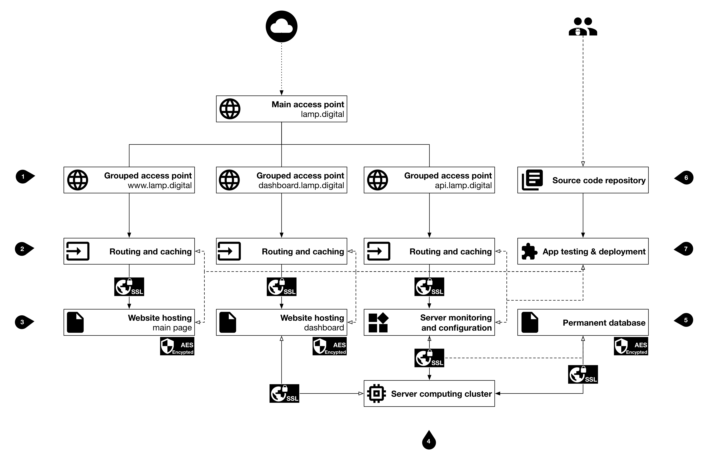

# Provisioning the LAMP Platform

*BIDMC Digital Psychiatry's LAMP Platform*

The LAMP Platform is cloud-agnostic and can be hosted on Amazon Web Services, Microsoft Azure, Google Cloud, any other cloud provider, or self-hosted on-prem. 

The LAMP Platform requires computing and storage resources (i.e. AWS EC2 and EBS), along with external network access;  managed services from cloud providers tend to provide robust and maintenance-free bring-up for the LAMP Platform and are recommended over self-hosting on-prem. Furthermore, additional services such as Amazon CloudFront or CloudFlare allow less expensive and more effective caching and edge content delivery of the mindLAMP Dashboard and UI without the need for multi-region deployments. 

A single Docker Stack file (`docker-compose.yml`) is used to automate single-node or multi-node deployments, and requires Docker Swarm (multi-node for cloud testing, integration, and production usage, or single-node for local testing or smaller deployments). Though possible to use Kubernetes or Terraform to manage larger scale deployments, the LAMP Platform has only been tested with Docker Swarm. 

**We provide additional examples for (1) local development, and (2) Amazon Web Services. 
If you or your organization have further questions about choosing a cloud provider or deploying on-prem, [please contact us.](mailto:team@digitalpsych.org)**

### Segmenting Compute Resources

*BIDMC Digital Psychiatry's LAMP Platform*

When developing or testing the LAMP Platform, it is useful and effective to segment compute resources and develop natively in the cloud (or on-prem). Consider carefully how your organization expects to the use the LAMP Platform and segregate computing resources (nodes) to reduce cost and improve performance. 

The LAMP Platform source code repositories are hosted on GitHub and use the GitHub Actions and GitHub Packages features to quickly perform continuous testing, integration, and deployment. As code is pull requested from a feature branch into the master branch, it should pass a round of code review and pass any/all unit tests. Once the code is merged, the automated CI/CD will prepare and upload Docker images. 

We highly recommend the use of `Portainer` to remotely manage your Docker Swarm nodes and container health, as well as `Traefik` for managing service mesh routing and in-flight TLS encryption; additional Docker Stack files and instructions are provided for both. The `Traefik` router interfaces with Docker Swarm and your DNS provider to automatically manage internal and external access to services, according to the configuration in the Docker Stack files provided. To monitor node health and container resource metrics, we recommend `Netdata` and have included it in the stack file below.

If you'd like to follow along but would like to test the deployment out first, or don't have provisioned resources yet, **consider using [Play With Docker](https://labs.play-with-docker.com/), a free service** from the Docker team where you can provision a temporary Swarm cluster.