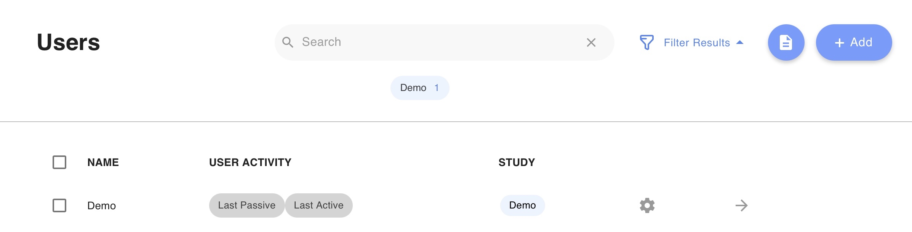

# Users vs Activities Tab

# Users

When the clinician or researcher logs in, they will see the Patients tab. Here, there will be a list of patients they have added.

The blue "Add" button is used to add patients or studies. For information about adding and managing patients, see [Create or Manage Users](Create%20or%20Manage%20Users.md).

Each patient will have the following attributes:

### Name

A patient's name is automatically generated as a de-identified patient identifier, typically beginning with a `U`, followed by a random number of random digits. Clinicians and researchers are able to change this name; see [Create or Manage Users](Create%20or%20Manage%20Users.md) for more information.

### Last Active

This provides information about when the patient logged into the on the LAMP Platform. It is **not** representative of the last time the patient completed a survey or activity.

### Indicators

The data quality indicators are representative of the passive data quality. They will be green, yellow, red, or gray depending on how recently passive data has been collected for that patient.

Green means that a patient's passive data has been collected within the last two days.

Yellow means that a patient's passive data has been collected within the last week.

Red means that a patient's passive data has been collected within the last month.

Gray means that a patient's passive data has never been collected.

### Study

Study shows which study a patient is participating in. To filter patients by what study they are in select the drop down menu "Filter Results." To view patients in a selected study, click on the study's bubble underneath the search bar.

# Activities

A clinician or researcher can navigate to the activities page by selecting "Activities" on the left menu bar of the dashboard.  Surveys and cognitive tests are examples of activities for patients. To learn more about specific activities, check out [What are the Components of LAMP?](What%20are%20the%20Components%20of%20LAMP.md).

The blue "Add" button is used to add activities and surveys manually or to import them. For information about adding and managing activities and surveys, see [Create Surveys](Activities Tips, Surveys, and Cognitive Tests/Create Surveys.md) and [Create Activities](Activities%20Tips,%20Surveys,%20and%20Cognitive%20Tests/Create%20Activities.md).

Each activity will the following attributes:

### Name

The name of the activity describes what the activity itself is; for example, "Mood" would be the mood tracker survey).

### Type

Type indicates if an activity is a tip, survey, cognitive test, or breathe activity type. Tips are fed to the patient or participant through Learn, surveys through Assess, and cognitive tests and breathe activities through Manage.

### Study

Study indicates which study an activity is a part of. To filter activities by what study they are associated with, select the drop down menu "Filter Results." To view the activities in a selected study, click on the study's bubble underneath the search bar.

