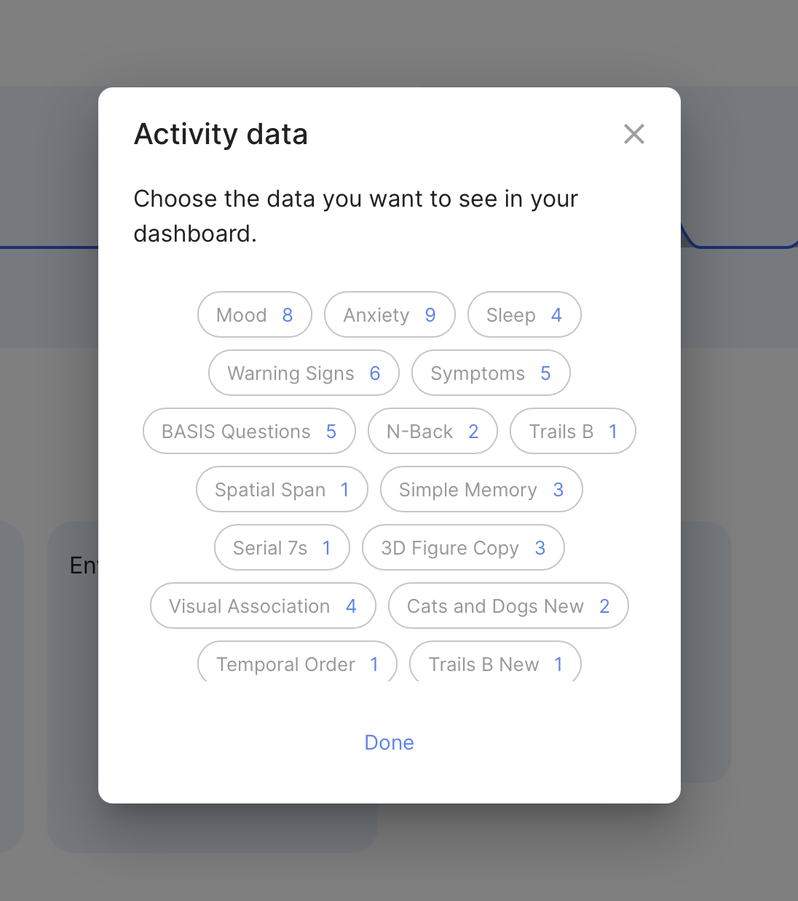
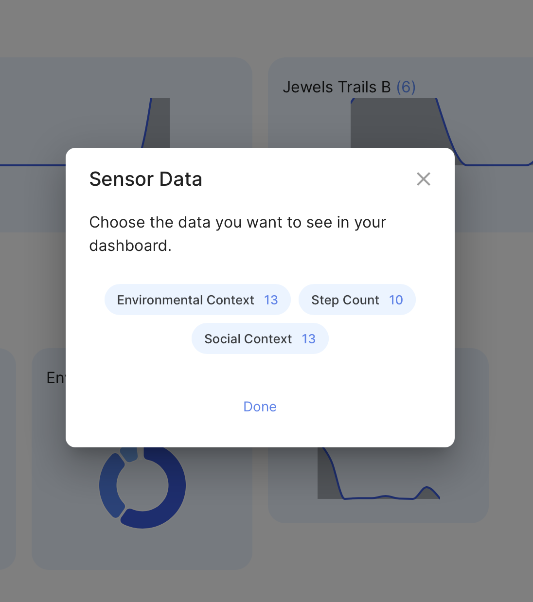
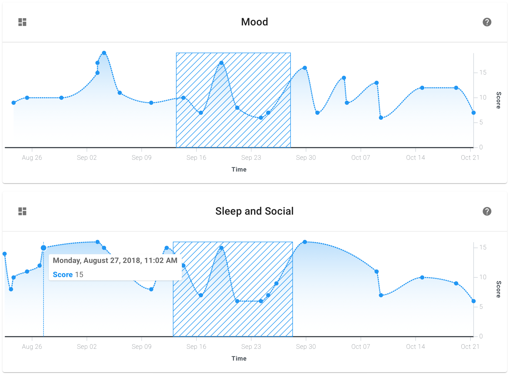
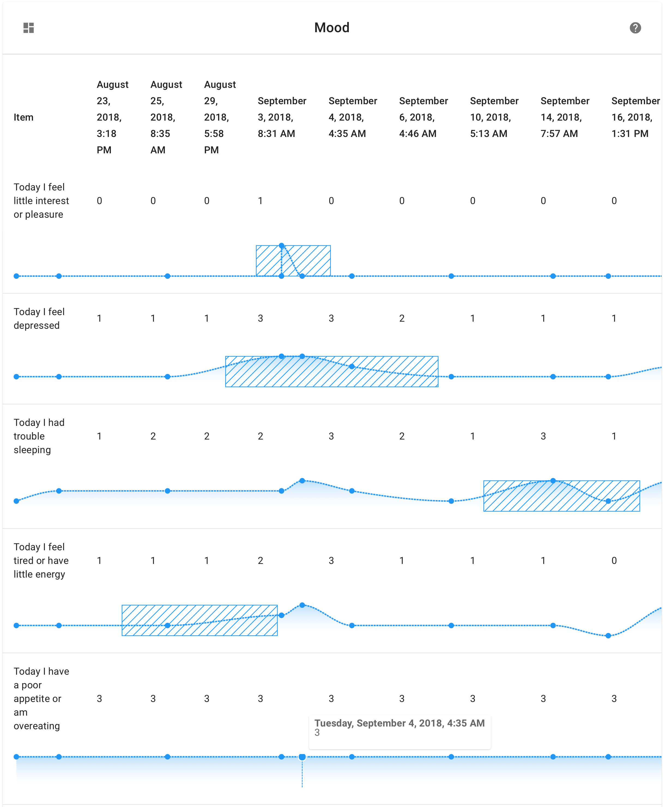
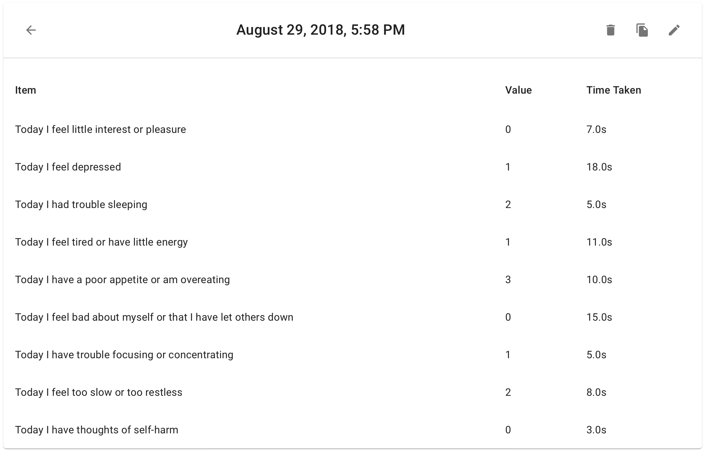
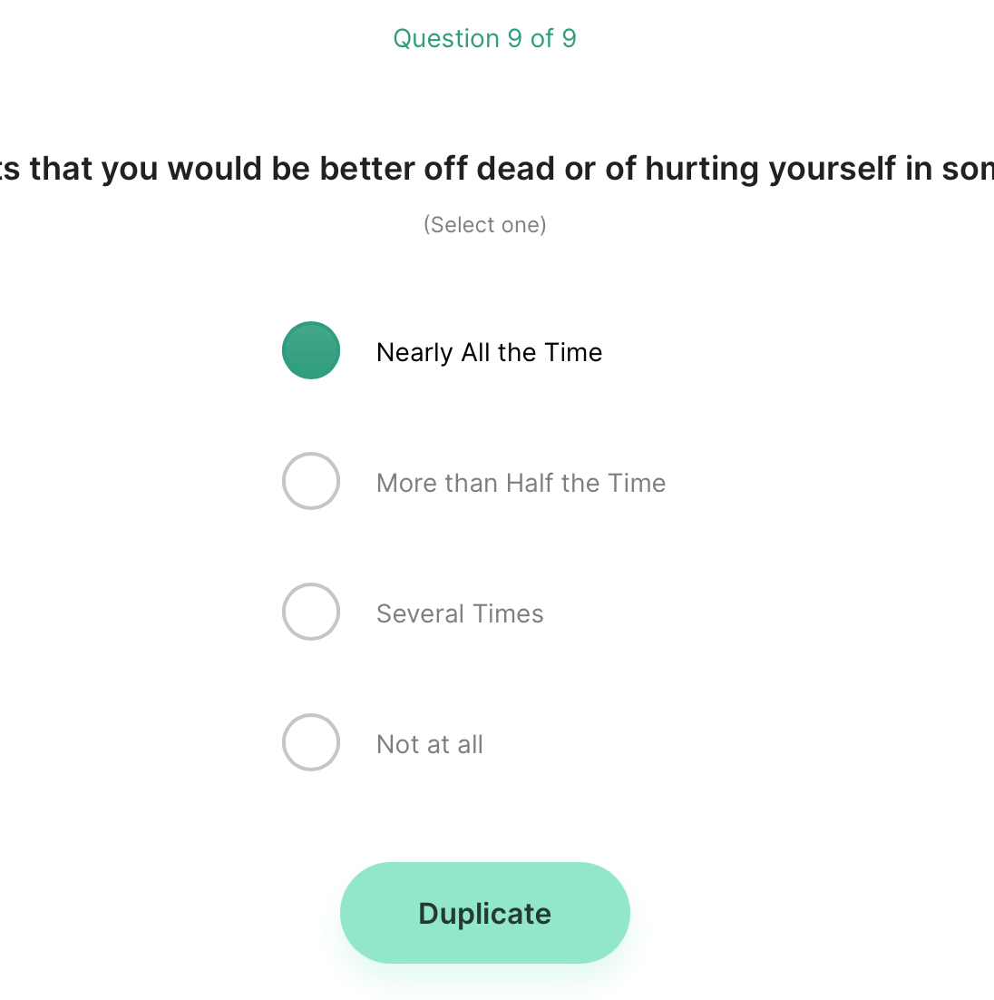
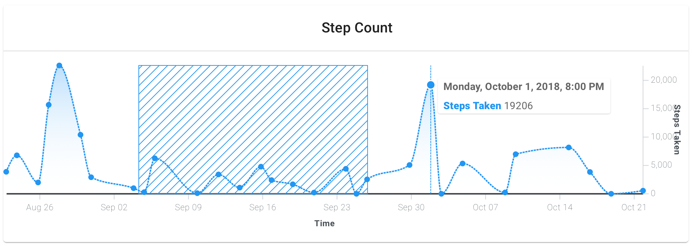

# Visualize data

If you would like to hide graphs on the Prevent page from patients or participants, [please contact us here.](mailto:team@digitalpsych.org)

### Step 1: View the different kinds of data available.

When you open the patient dashboard, in the visualizations section you'll see either two or three sections, as explained below:

1. **Activity:** this section is where you'll find data for surveys you've taken and games you've played.
2. **Sensor:** this section is where you'll find health data from your smartphone sensors, such as step count. Please note that sensor data is not always 100% accurate and highly depends on what type of device is being used.
3. **Automations:** this section is **experimental** and must be enabled. [Please click here to reach out to us for more information.](mailto:team@digitalpsych.org)

Data on the dashboard is hidden by default; to view these graphs, you must select them first.

Each item in these sections appears as a bubble with a name, as well as a small blue indicator at the top of the bubble representing the count of data points in that graph. To select a graph as visible, tap on the bubble in the dialogue; to select a graph as invisible again, tap the bubble again.

### Step 2: View a selected graph of data.

Once a graph is selected as visible in its default view, it appears with a toolbar at the top including the following information and actions:

1. The name of the Activity appears in the center.
2. Hovering over the name of the Activity shows what kind of Activity it was (i.e. a survey or game).
3. The **Switch Views** button appears at the left side of the toolbar.
4. The **Help** button appears at the right side of the toolbar. 
5. The timeline axis appears at the bottom of the graph, and the score axis appears at the right side of the graph.

Hover over a data point to see its exact date and time, along with its score and other parameters saved. You can also select and drag a region of the graph on non-mobile devices to share and annotate.

Tapping the **Switch Views** button allows you to toggle between **Overview** and **Expanded** modes. In the **Expanded** mode, you'll be able to see each individual question as its own sparkline graph over time, along with the actual value of that data point.

Tapping on any blue dot will enter **Detail** mode, where you will see all the parameters saved for that data point alone. In this view, the toolbar will contain the following: 

1. The date and time of recording this data appears in the center.
2. Hovering over the date and time shows the name of the Activity.
3. The **Back** button appears at the left side of the toolbar.
4. The **Editing** panel appears at the right side of the toolbar with **Delete**, **Duplicate**, and **Overwrite** buttons.

To return to your previous view, tap the back button.

To learn more about the **Editing** panel, see the next step.

### Step 3: Delete, duplicate, overwrite survey responses.

**If you're logged in as a clinician or researcher**, the three actions available in the **Editing panel** are:

1. **Delete:** hide this data point from the graph.
2. **Duplicate:** copy this data point's information to "carry it forward" when saving a new data point from the graph.
3. **Overwrite:** replace this data point by adding a new data point and hiding the original data point from the graph.

Please note that the **Delete** and **Overwrite** options only hide the original data point from graphing; the data itself **IS NOT** deleted from the LAMP Platform. 

**Contact your server administrator or your organization's IT department** to restore data that may have been incorrectly hidden or temporarily deleted.

**Duplicate**

**Overwrite**

### Step 4: Show step count and other sensor data.

If your clinic or study has enabled some sensor types, you'll find them here in this section. As before, tap on an item's bubble to view the graphs for that type of data. You'll see **Step Count** as an example below. 

Want to get your data science team involved for even more visualization options? Check out [[Data Science with LAMP](https://www.notion.so/5420896d7b034afa8326f28e6bd24000)](Data%20Science%20with%20LAMP.md).

---

**Was there something we didn't cover, or need more help?**
Let us know by making a post in the [LAMP Community](https://community.lamp.digital/), or [contact us directly](mailto:team@digitalpsych.org). Thank you for your contribution! 🌟
*Page last updated on October 29th, 2020.*