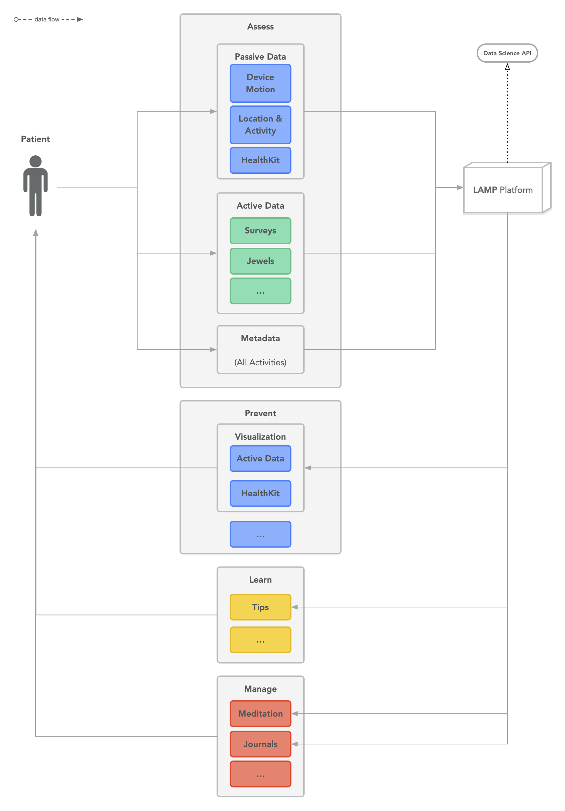

LAMP stands for Learn, Assess, Manage, Prevent. It is a measurement based care platform designed for both research and clinical use. The core components are the app and the dashboard.

### The App

The LAMP smartphone app mindLAMP2 collects multiple, customizable data streams from a user and offers activities that encourage mindfulness and and self-reflection. The types of data that the app collects are active and passive data. Active data includes information collected when the individual is using the app. Passive data includes information collected in the background even if the user is not using the app. Surveys, activities, tips, etc. are customizable and able to be grouped. For example, participants in the same research study can be grouped so they receive the same set of activities and surveys.

### The Dashboard

The dashboard allows both you and the user to view the information that was collected from the smartphone app. The dashboard allows clinicians, researchers, and patients to visualize data that is collected and aid in treatment and/or research. 

### Diagram of the LAMP Platform

