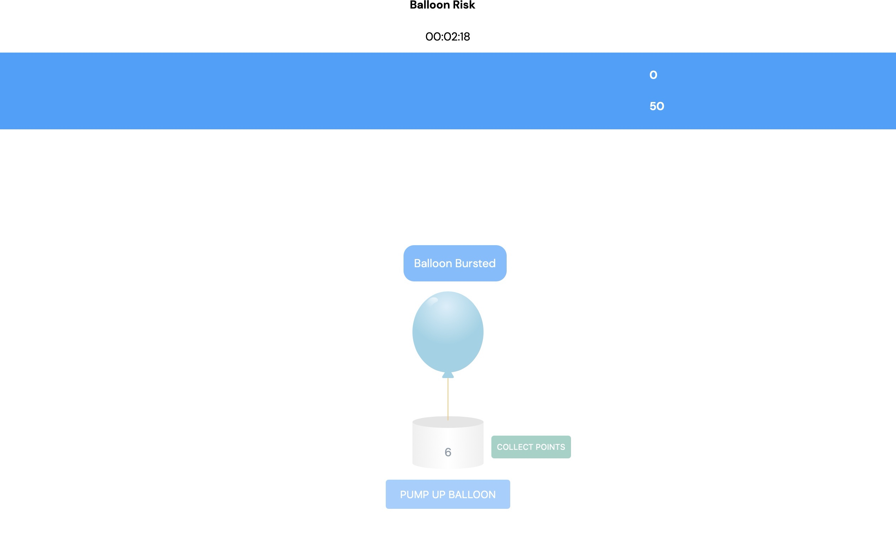

# LAMP Platform User Guide

**[→ Learn more about mindLAMP, the Data Center, and Cortex here.](https://www.notion.so/639795322997472a835e42f8e1314fdb)**

The **LAMP Platform** is a neuropsychiatric research and clinical care management platform designed to help you manage your research studies and digitally-enabled clinics. The many robust components of the platform work together to automate your workflows and simplify clinic and data management. Today, the **LAMP Platform** is indexed in the World Health Organizations Digital Health Atlas, used around the globe by many research groups, and implemented in busy community clinics, including at major **Harvard Medical School** teaching hospitals.

# Quick Links

 🌎 **[→ Learn more about the Division of Digital Psychiatry.](https://www.digitalpsych.org/)**

[→ Download and Use the mindLAMP app.](LAMP Platform User Guide/%E2%86%92 Download and Use the mindLAMP app.md)

[→ Report a bug or request a feature.](LAMP Platform User Guide/%E2%86%92 Report a bug or request a feature.md)

 📰 **[→ Ask a question on the community forum.](https://mindlamp.discourse.group)**

---

# 🤔 Thinking about Using mindLAMP?

*Curious to learn more about the Platform? Explore here to learn more about LAMP and register your interest!*

[How does LAMP Platform Work?](LAMP Platform User Guide/How does LAMP Platform Work.md)

[LAMP User Prerequisites](LAMP Platform User Guide/LAMP User Prerequisites.md)

[Types of Users](LAMP Platform User Guide/Types of Users.md)

[Privacy Policy](LAMP Platform User Guide/Privacy Policy.md)

[Security & Privacy](LAMP Platform User Guide/Security & Privacy.md)

# 📨Register Your Interest Here

**→ [LAMP Platform Interest Form](https://docs.google.com/forms/d/e/1FAIpQLSeNyY469zPcwVoZ8gKTwW8dLuzRDXpObLcR8JtHdUlRhAQcyQ/viewform?gxids=7757)**

**→ [How will you use LAMP?](https://docs.google.com/forms/d/e/1FAIpQLScCHNRqCIbVOxg1JBz1lsdu1-94tnlYq2hA_0wOPafFRDFrrA/viewform)**

# ❓ **Frequently Asked Questions**

- Expand to view

    ### Why are there two mindLAMP apps available? Which one should I use?

    The app that is associated with the LAMP Platform is called mindLAMP. mindLAMP 1 is no longer being used and has been replaced by mindLAMP 2. You will no longer be able to download or use the mindLAMP 1 app in early 2021.

    ### How do I transition from mindLAMP 1 to mindLAMP 2?

    If you are using mindLAMP with a web browser like Chrome, Safari, Firefox etc. then it will automatically have updated. If you are using the app, simply download mindLAMP 2 from the App Store or Play Store and log in. See [Download the mindLAMP App](https://www.notion.so/Download-the-mindLAMP-App-3dfeac4295b941939543b8e61524d338) for more information.

    ### Do I need a wearable to collect passive data?

    HealthKit data is only available with wearables with two exceptions: step count and sleep data. Step count can be gathered through your mobile device, and sleep data can be gathered by downloading specific apps on iOS (napbot) and Android (sleep as android). mindLAMP requires WatchOS 7 and WearOS 2. Please see [Wearables](LAMP Platform User Guide/Wearables.md) for more information.

    ### What's a system administrator?

    This is usually your Information Technology (IT) or Information Services (IS) department at your institution.

    ### How do I get login information?

    If you or your organization is self-hosting the LAMP Platform independently, please contact your administrator or IT department for your login information; [otherwise, please contact us.](mailto:team@digitalpsych.org)

    ### How do I reset my password?

    If you are a study participant, please reach out to your research coordinator. If you are a patient, please reach out to your clinician. If you are a research coordinator or clinician, please reach out to your system administrator or IT department. 

    ### What's a study?

    A study comprises of a set of activities that multiple patients will interact with and receive notifications for, such as surveys or breathing exercises, as well as a set of sensors which will be enabled to collect data on the patients' smartphones or wearable devices. Researchers and clinicians add able to create and manage multiple studies.

    ### What's the difference between a survey and an activity?

    "Activity" is a broad term that encompasses different items that patients can interact with inside of the mindLAMP app. This includes cognitive tests, mindfulness, meditation, and more. A survey is a type of activity that presents a set of questions for patients or participants to answer.

    ### How do I create a survey?

    Click the `[+ Add]` button at the top right of the list and select "Survey Instrument". See [Create Surveys](LAMP Platform User Guide/Activities Tips, Surveys, and Cognitive Tests/Create Surveys.md) for more information.

    ### Can I edit a survey?

    Yes, you can edit it from the activities tab by tapping on its row in the list. See [Create Surveys](LAMP Platform User Guide/Activities Tips, Surveys, and Cognitive Tests/Create Surveys.md) for more information. We recommend only editing surveys to fix typos or adjust the language of a question or response choice.

    ### What happens to my data after I delete a survey?

    Deleting a survey or other activity automatically deletes their response data across all participants or patients. This data is always recoverable — please reach out to your system administrator for help recovering data. 

    ### How do I delete a survey?

    Select one or more survey instruments you would like to delete and press the trash can icon at the top right of the list. See [Create Surveys](LAMP Platform User Guide/Activities Tips, Surveys, and Cognitive Tests/Create Surveys.md) for more information.

    ### How do I customize an activity?

    Click the `[+ Add]` button at the top right of the list and select your desired activity. All customization options for a specific activity will be on the screen that follows.

    ### There aren't any surveys or activities in my Feed. Why?

    You may need to set schedules for the surveys or activities that you have assigned to your study. Please make sure you're viewing the Feed on a day where one of those schedules is activated to send notifications. 

    ### Why is my Manage section appearing blank?

    You must add activities for them to show up in a specific tab. If there are no activities created for a specific tab, that tab will remain blank.  See [Create Surveys](LAMP Platform User Guide/Activities Tips, Surveys, and Cognitive Tests/Create Surveys.md) for more information.

    ### Who can see my data?

    Your system administrator will only access your personal information to support internal operations, including troubleshooting/user support, and service improvements. To ensure you are receiving the highest level of service in your interaction with the mindLAMP app, the Division of Digital Psychiatry may use your contact information to communicate with you regarding your requests. We also use this data to create aggregated statistics which helps us in the improvement of our service. For more information, please see our [Privacy Policy](LAMP Platform User Guide/Privacy Policy.md).

    ### Does the mindLAMP app work offline?

    The mindLAMP app does not currently work offline. However, this is a highly requested feature that we are working on. Stay in the loop about this by checking out [[What's New with LAMP?](https://www.notion.so/3f8828a4fd1b40ab947af4ce08ae7694)](https://www.notion.so/What-s-New-with-LAMP-c6fb984faf6842c2af9d70ab788add2f) 

    ### Where do I report a bug or request a feature?

    Submit any bugs or feature requests here: [Report a Bug or Request a Feature](https://www.notion.so/Report-a-Bug-or-Request-a-Feature-be1e3c107e354663b2d1726632816d99) 

    ### Is mindLAMP 2 available in other languages?

    The mindLAMP app currently supports Hindi and Spanish. Stay in the loop about future plans by checking out  [What's New in the LAMP Platform?](LAMP Platform User Guide/What's New in the LAMP Platform.md)  

# 🍎 Why Use the LAMP Platform?

*Not sure why you should use the LAMP Platform? Read more here.*

[How mindLAMP, the Data Center, and Cortex Work Together](LAMP Platform User Guide/How mindLAMP, the Data Center, and Cortex Work Tog.md)

[What is the LAMP Platform?](LAMP Platform User Guide/What is the LAMP Platform.md)

[What are the Components of LAMP?](LAMP Platform User Guide/What are the Components of LAMP.md)

[LAMP: Platforms vs. Apps](LAMP Platform User Guide/Topics/LAMP Platforms vs Apps.md) 

[How does the LAMP data format work?](LAMP Platform User Guide/How does the LAMP data format work.md)

[Consortium Webinar Recordings](LAMP Platform User Guide/Consortium Webinar Recordings.md)

# 🆕 New Users Start Here!

*Ready to start using LAMP? Click here to learn the basics of surveys, activities etc.*

[Accessing Your Account](LAMP Platform User Guide/Accessing Your Account.md)

[Log In Information, Tips, and Tricks](LAMP Platform User Guide/Log In Information, Tips, and Tricks.md)

[Users vs Activities Tab](LAMP Platform User Guide/Users vs Activities Tab.md)

[Create or Manage Users](LAMP Platform User Guide/Create or Manage Users.md)

[Activities: Tips, Surveys, and Cognitive Tests](LAMP Platform User Guide/Activities Tips, Surveys, and Cognitive Tests.md)

[View the Dashboard](LAMP Platform User Guide/View the Dashboard.md)

[Visualize data](LAMP Platform User Guide/Visualize data.md)

[Care Team - Connection with Patients ](LAMP Platform User Guide/Care Team - Connection with Patients.md)

[Survey Instrument Library](LAMP Platform User Guide/Survey Instrument Library.md)

[Wearables](LAMP Platform User Guide/Wearables.md)

# 🖥️ LAMP for IT

*Running LAMP on your own server? Hosting your own data? Look no further!*

[Prerequisites for Deploying the LAMP Platform](LAMP Platform User Guide/Prerequisites for Deploying the LAMP Platform.md)

[Deployment Recommendations](LAMP Platform User Guide/Deployment Recommendations.md)

[Costs of Deploying the LAMP Platform](LAMP Platform User Guide/Costs of Deploying the LAMP Platform.md)

[Provisioning the LAMP Platform](LAMP Platform User Guide/Provisioning the LAMP Platform.md)

[Preparing Resources on AWS](LAMP Platform User Guide/Preparing Resources on AWS.md)

[Deploying the LAMP Platform](LAMP Platform User Guide/Deploying the LAMP Platform.md)

[Testing the LAMP Platform](LAMP Platform User Guide/Testing the LAMP Platform.md)

- Cloud Network Diagram

    

# 🖥️ LAMP for Developers

[Components of the LAMP Platform](LAMP Platform User Guide/Components of the LAMP Platform.md)

[How the Platform Works](LAMP Platform User Guide/How the Platform Works.md)

[Low Power & Connectivity Support](LAMP Platform User Guide/Low Power & Connectivity Support.md)

[Continuous Monitoring & Intervention Delivery](LAMP Platform User Guide/Continuous Monitoring & Intervention Delivery.md)

[Building New Activities](LAMP Platform User Guide/Building New Activities.md)

[How Interventions Work (Flow Diagram)](LAMP Platform User Guide/How Interventions Work (Flow Diagram).md)

[[Data Science with LAMP](https://www.notion.so/Data-Science-with-LAMP-5420896d7b034afa8326f28e6bd24000)](LAMP Platform User Guide/Data Science with LAMP.md)

*Documentation of the LAMP API and support around analytics using LAMP.*

[Cortex](LAMP Platform User Guide/Cortex.md)

*Learn about our data analysis pipeline.*

[What's New in the LAMP Platform?](LAMP Platform User Guide/What's New in the LAMP Platform.md)

*Find weekly updates on everything from current bugs to UI improvements here!*

[Who's using LAMP?](LAMP Platform User Guide/Who's using LAMP 53f8b088b77d422fb9a6e83ca6e0e240.csv)

*Looking for inspiration? Just curious? Take a look at who's using LAMP!*

[MAPNET](LAMP Platform User Guide/MAPNET.md)

*Information for MAPNET sites.*

---

**Was there something we didn't cover, or need more help?**
Let us know by making a post in the [LAMP Community](https://community.lamp.digital/), or [contact us directly](mailto:team@digitalpsych.org). Thank you for your contribution! 🌟
*Page last updated on March 2nd, 2021.*

- `Index`

    [Why Use the LAMP Platform?](LAMP Platform User Guide/Why Use the LAMP Platform.md)

    [Topics](LAMP Platform User Guide/Topics 00d1e6eb213f4bb7b778fa41bc55b3a8.csv)