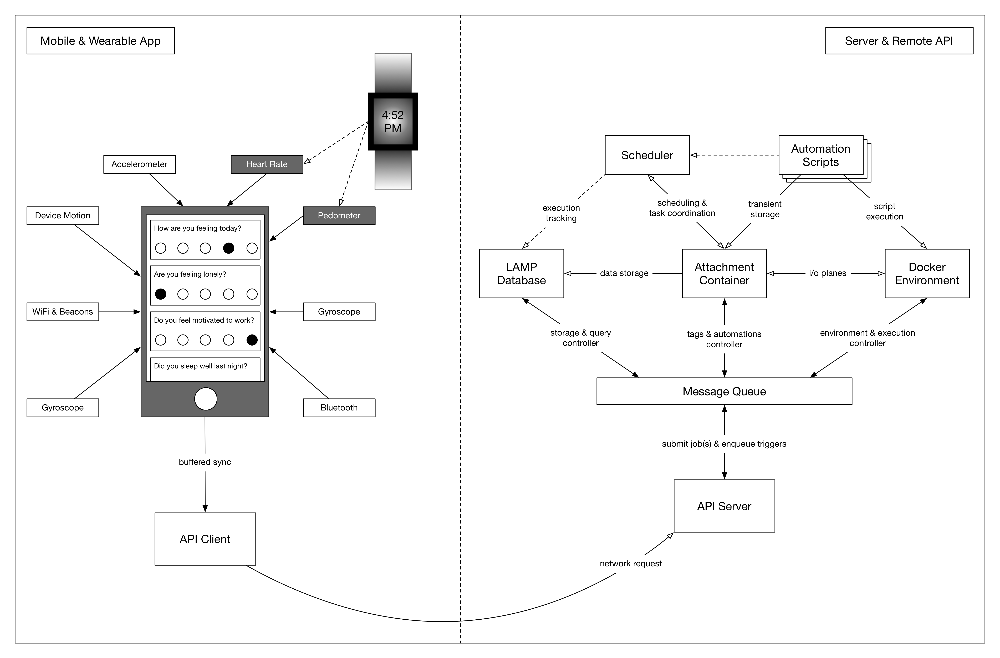

The LAMP Platform always collects data in a secure way before automatically processing and harmonizing it for you. Researchers/clinicians, and patients/participants can view their data in the frontend user interface. Patients will always retain ownership when contributing their data to your study or clinic and may always download and view their own data. Cognitive tests and survey instruments collect high quality metadata that can measure attention, focus, memory performance, and more.

The LAMP Protocol, upon which the LAMP Platform is built, may also be integrated into other systems as it is intuitive, simple, and has security and privacy built-in. It models active and passive data together as evolving streams of events, and data becomes reactive and clinically actionable through user-defined applets across R, Python, and JS. Credential management is built into the object hierarchy, which uses OpenAPI and JSONSchema to mark up extensible interfaces. The industry encryption standards AES-256 and TLSv1.3 facilitate secure storage and transmission of data in a HIPAA, COPPA, and GDPR-compliant manner.

The **LAMP Platform** consists of two broad domains: **(1) local**: the components that users will see and interact with through smartphone or wearable devices, and **(2) remote**: the components located off-device that process data, coordinate applets, and handle synchronization. The app serves to both capture diverse streams of sensor and activity measurements ranging from heart rate to mood and to prompt suggested user interactions. It informs the **LAMP Platform** with a micro-temporal slice of the user’s physical and mental health. The server components supporting the **LAMP Platform** play an equally important role in securely encrypting and processing the data, establishing the user’s “digital fingerprint” and predicting changes that could potentially result in relapse. app-based interventions can be deployed to improve the user’s health and relevant health data can automatically be shared with authorized care team members.

The figures below detail one operation typically performed by the **LAMP Platform**. Shown on the left-hand side is the app, and on the right-hand side is the server. Note that both pieces consist of numerous components that work together as a modular distributed system to transfer and process data in a clinically relevant context. A full specification of all components and their interactivity is documented in later sections. Please note that an important distinction in naming is made between the **local** and **remote** domains: the components of the former are prefixed with “**mindLAMP**” where the components of the latter are prefixed only with “**LAMP**” as this distinction clarifies the scope and requirements of the components themselves.

## Step 1: Sensor events are recorded in real-time.

High-frequency sensors on the mobile or wearable device record measurements based on the user’s current configuration settings defined by an administrator. This data is stored in a buffer on the device's hardware managed by the operating system (either iOS or Android) and provided to the app periodically while it is in the background.

## Step 2: Collected events are cached, awaiting server reachability.

The device’s buffer and operating system make no guarantees to save data from the current moment for the next time the app is run in the background. Because of this and the likelihood that the remote server may not be reachable due to poor signal, the measurements are immediately cached by the app whenever it is notified in the background. When battery levels are sufficient, and network connectivity to the remote server available, and enough data is cached, the app begins synchronization.

## Step 3: Server receives and processes requests from the app.

The app submits a request to the server for synchronizing and uploading its cached data. Once uploaded successfully, it is unpacked and examined by the server for further automated processing.

## Step 4: Server coordinates internal components for processing.

The server prepares instructions for internal components based on the data uploaded by the app. These instructions are pushed through the internal data bus (a message queue) that connects all internal controllers in the platform. The extensibility of the internal components and the data bus interconnecting them means components can be swapped out or replaced depending on context. In deployments or regions where some features should be disabled, their relevant components are "unplugged" from this data bus.

## Step 5: Database records the incoming data.

Depending on the server’s system configuration and the content of the data uploaded, the database then records all event data and schedules an automated backup. The database considers the origin of the events as it saves them, harmonizing data from various sensors through a unified schema.

## Step 6: The scheduler coordinates and runs automations.

Once the database completes saving data and any backup processes, the scheduler component is engaged to determine if any data processing “applets” or other internal maintenance tasks need to run. After assessing cost and priority, the scheduler creates an execution plan consisting of the above and notifies these components. The scheduler relies on heuristics gathered from audit logs to determine the plan.

## Step 7: Applets are launched into a safe environment and run.

Assuming no internal maintenance tasks need to run, the scheduler may create an execution plan with only a single applet. Once started, a new virtual environment is prepared and securely isolated from other data. For example, an R environment would analyze the script to run and install the correct versions of all required packages, replicating the environment used by the applet's author.

[Please contact us directly for guidance on delivery of just-in-time interventions.](mailto:team@digitalpsych.org)

## Step 8: Applet results are saved after being run.

As the applet executes, its input and output are spliced from the automation controller and saved as tags. For example, an applet called "com.test.some_script" may create a new tag “com.test.some_script” attached to some resource in the database, or append to an existing tag with the same name. Any runtime logs are extracted separately from this result.

## Step 9: Applet results are persisted for later access.

If an applet is configured to persist its output, the data are persisted to the database as a tag and may be accessed by a client app directly at a later time. For example, an applet may compute a dynamic visualization to be cached, or it could lookup login credentials from a predefined tag to access and convert data from a third-party system such as Fitbit into native resource objects which are then persisted by the database.

## Step 10: Scheduler updates invocation and audit log.

Once an execution plan completes, the scheduler records statistics about it for its next engagement.

## Step 11: Request completes with any response data.

If any controller responds to their currently executing instruction with a response payload (such as the execution output of an applet), it is bundled and returned to the API client synchronously. If a controller needs more time to process an instruction, it can return a pointer to an operation resource that can be used in a later asynchronous request to the server to locate the response once completed. If a controller chooses to respond to an instruction but is unable to complete it, the response returns immediately to the client app as an error.
