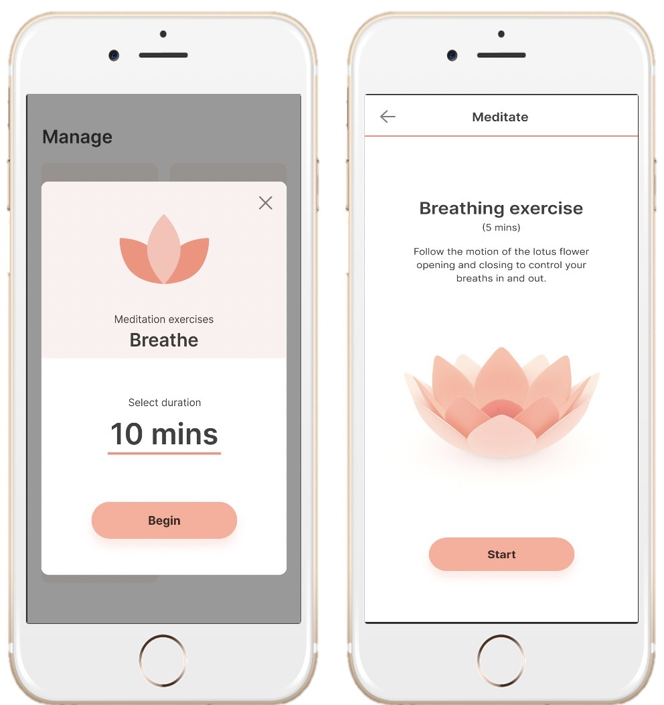
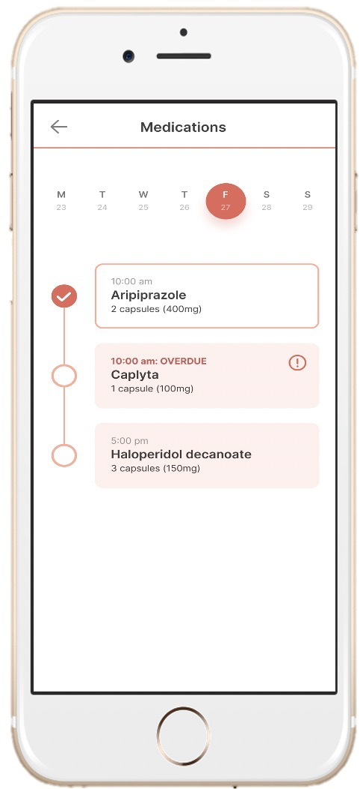
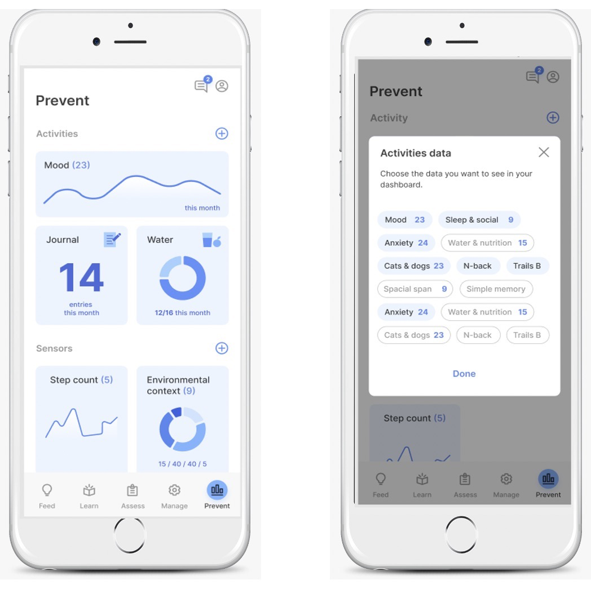

# LAMP is Organized Into Four Tabs: 
Learn, Assess, Manage Prevent

# **LEARN**

Tips and resources for patients and study participants are entered by researchers or clinicians through the Dashboard. Notifications for patients and study participants to review tips or resources can be preset and customized to be delivered at any time during the day.

Clinicians and researchers offer patients and study participants useful health related tips and resources in the Learn tab.

To learn more about customizing a tip for a patient, check out [Customize and Schedule Activities](Activities_Tips,_Surveys,_and_Cognitive_Tests/Customize_and_Schedule_Activities.md).

# **ASSESS**

Surveys and cognitive games – their content, answer choice style, and time of delivery – are customized by clinicians and researchers in the Dashboard. Patients and study participants complete them on the app and answers are stored over time.

Patients and study participants complete cognitive games and customized surveys related to mood, symptoms, and behaviors unique to them through the Assess tab.

To learn how to create surveys for this tab, check out [Create Surveys](Activities_Tips,_Surveys,_and_Cognitive_Tests/Create_Surveys.md).

# **MANAGE**

All activities are available through the Manage tab—below is an outline of the activities currently available or coming soon.

**Journal**

*Record thoughts, write lists, and make notes. Journal entries are date and time stamped so previous entries can be recalled and read at any time.*

**Guided Meditation**

*Watch a soothing video to refocus energy and attention. Add an audio recording to customize the sound.*

**Scratch Card**

*Select an image to “uncover” by sliding finger over screen until the image is revealed.*

**Medication Tracker (Coming Soon)**

*Enter medication information in a calendar to receive daily reminders, track intake, and ensure prescriptions are refilled in time.*

**Goal Setter (Coming Soon)**

*Enter a goal, small or big, and opt in/out of customized related reminders. The Goal Setter also lets users mark goals as complete and keeps track of completed goals.*

**Thought Log (Coming Soon)**

*Offload negative thoughts or feelings by writing them down. Thoughts appear as bubbles that are popped and disappear afterwards.*

**Hope Box (Coming Soon)**

*Collect and save favorite images and quotes to an album. The Hope Box is a digital scrapbook of positive moments.*

**Safety Plan (Coming Soon)**

*Work with trusted peers or health care team to identify personal signals of anxiety, sadness, or unease and record coping mechanisms.*

To learn about customizing activities in the manage tab, check out [Customize and Schedule Activities](Activities_Tips,_Surveys,_and_Cognitive_Tests/Customize_and_Schedule_Activities.md) 

# **PREVENT**

mindLAMP collects a combination of active and passive data. Patients and study participants, and clinicians and researchers, can view aggregated data on mindLAMP or on the Dashboard. Data appears in charts.

Data collected from mindLAMP – including survey responses and passive data such as step count – can be viewed through the Prevent tab.

To learn more about viewing your data, see [Visualize data](Visualize_data.md).
