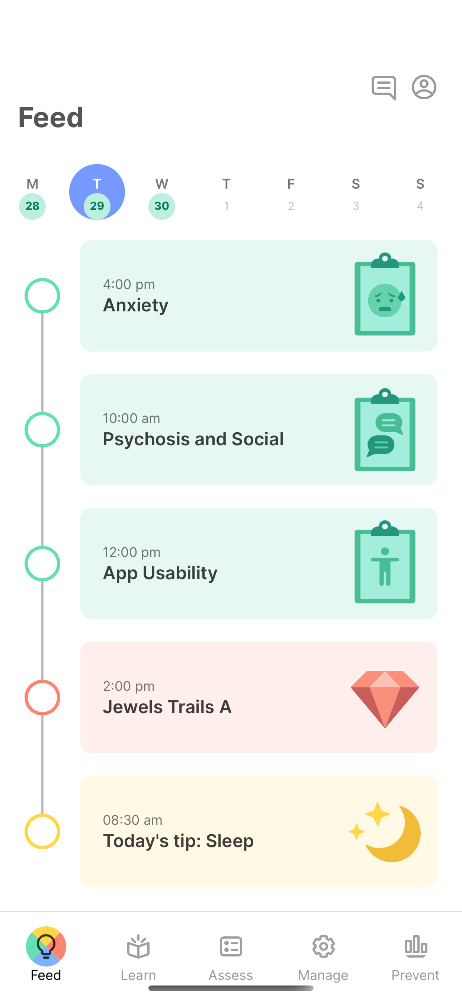
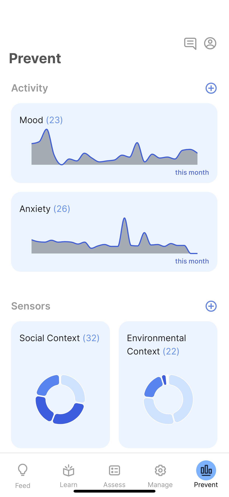
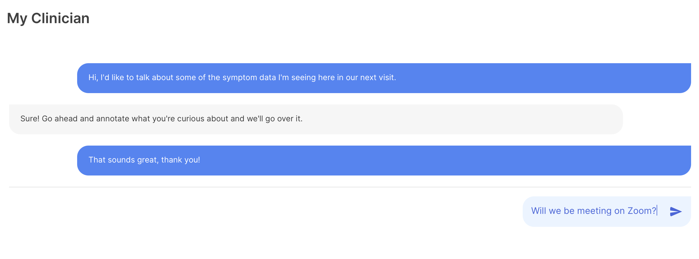

The app can be customized to your organization or clinic's need to include all or just some of the below sections. Choose the ones that suit your needs best. Some visualizations will only be possible when certain data is collected. We are always working to create new visualizations. 

# Feed

This is the main section of the app where patients can read tips, take surveys, play games, and use helpful exercises. **This feature is enabled by default.** 

To learn more about how to use this section, see [Take Surveys and Complete Activities](Activities_Tips,_Surveys,_and_Cognitive_Tests/Take_Surveys_and_Complete_Activities.md).

# Visualizations

This section of the app allows patients and clinicians to visualize different data, from surveys, games, and more, including sensors on the mobile device where mindLAMP is installed. **This feature is enabled by default.**

To learn more about how to use this section, see [Visualize data](Visualize_data.md).

More ways to visualize passive data are coming soon. Stay up to date by checking out [[What's New with LAMP?](https://www.notion.so/3f8828a4fd1b40ab947af4ce08ae7694)](https://www.notion.so/What-s-New-with-LAMP-c6fb984faf6842c2af9d70ab788add2f) 

## Care Team & Conversations

This section of the app is useful to integrate a care team into mindLAMP and enables messaging features between patients and clinicians. **This feature is disabled by default.** 

For more information, check out [Care Team - Connection with Patients ](Care_Team_-_Connection_with_Patients.md).
