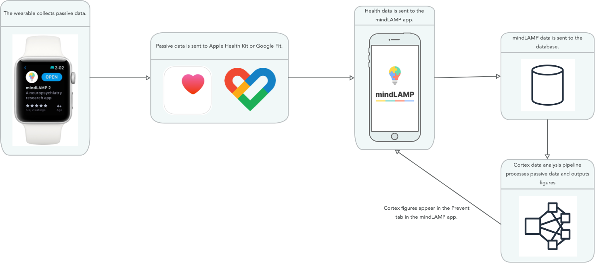

# Wearables

### Requirements

mindLAMP requires WatchOS 7 and WearOS 2.

### Do I need wearables to collect passive data?

HealthKit data is only available with wearables with two exceptions: step count and sleep data. Step count can be gathered through your mobile device, and sleep data can be gathered by downloading specific apps on iOS (napbot) and Android (sleep as android). 

### How do I access raw data collected from wearables?

Visualizations are can be displayed on the Prevent tab.
